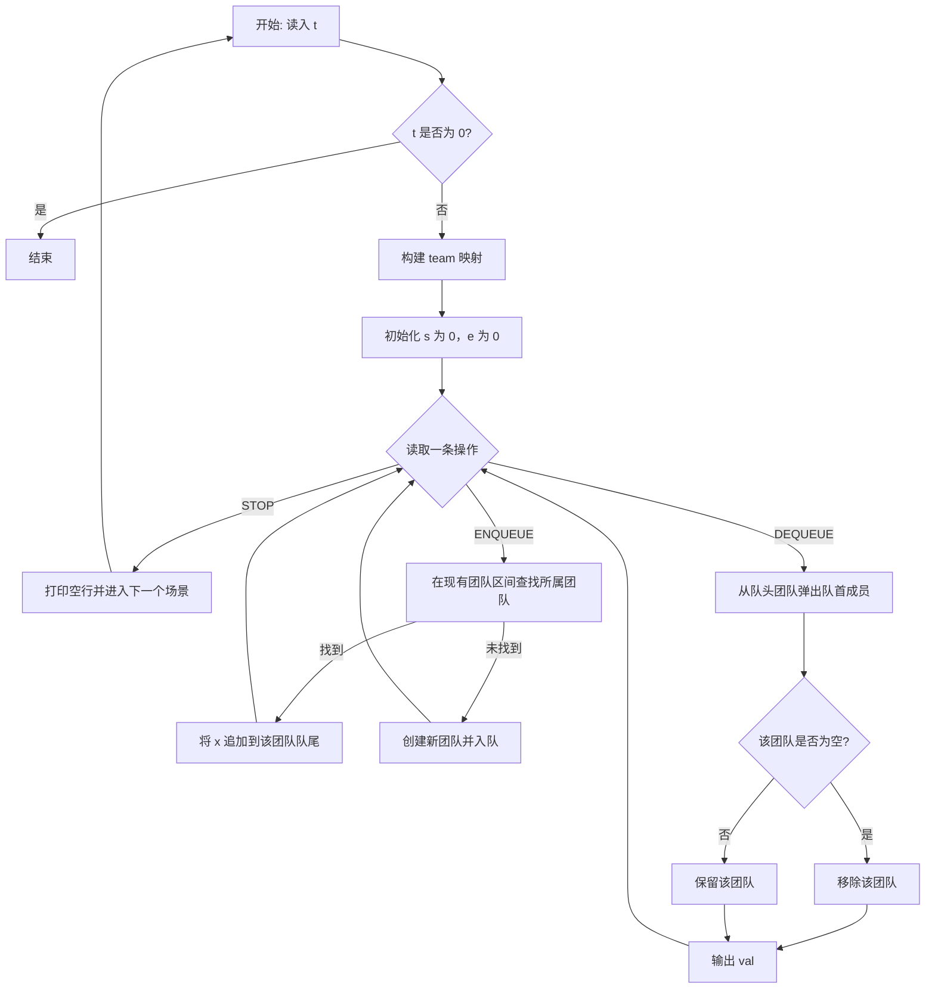

### [士兵队列问题](https://acm.hdu.edu.cn/showproblem.php?pid=1276)
- hint: 双队列模拟
- get: while使用场景，深入理解dequeue
- 约瑟夫变式问题
```cpp
int main() {
    Queue<int> q1,q2;
	int t;
	cin >> t;
	while(t--){
		int n;
		cin >> n;
		for(int i = 1; i <= n; i++) q1.enqueue(i);
		while(q1.getSize() > 3){
			int cnt = 0;
			//筛选报1的到2队
			while(q1.getSize()){ //最终会排空，之前还一直理解不了，还以为执行完会有元素
				int v = q1.dequeue();
				++cnt;
				if(cnt % 2 == 1) q2.enqueue(v);
			}
			//考虑q2特殊情况
			if(q2.getSize() <= 3) {
				while(q2.getSize()) q1.enqueue(q2.dequeue());
				break;
			}
			
			cnt = 0;
			while(q2.getSize()){
				int v = q2.dequeue();
				++cnt;
				if(cnt % 3 == 1||cnt % 3 == 2) q1.enqueue(v);
			}
		}
		int flag = 0;
		while(q1.getSize()){
			if(flag) cout <<' ';
			cout << q1.dequeue() ;
			flag++;
		}	
		cout << endl;
	}
	
	return 0;
}
```


### [团队队列](https://acm.hdu.edu.cn/showproblem.php?pid=1387)
- hint:
- get: ```memset(x,val,sizeof(x))```,辨析```Queue<int> q[1001]```,哈希表？

```cpp
// team[x] 存储成员 x 的 teamId，范围按题意预留（这里示例为 1e6）
int team[1000000];

int main(){
	int t;                 
	int cases = 0;         
	while(cin >> t && t){  // 多个测试用例，读到 0 结束
		cases++;
		memset(team, 0, sizeof(team));

		// 读入每个团队的成员，建立 id -> teamId 的映射
		for(int i = 1; i <= t; i++){
			int n;          
			cin >> n;
			while(n--){
				int x;      
				cin >> x;
				team[x] = i; // 记录 x 属于第 i 个团队
			}
		}

		Queue<int> q[1001]; //注意，这个可不是tmd（），这是1001个队列，而不是一个队列；就这个问题半天理解不了；
		int s = 0, e = 0;   // s 为队头团队索引，e 为队尾后一位（半开区间）
		string str;
		cout << "Scenario #" << cases << endl;

		// 处理操作，直到遇到 STOP
		while(cin >> str){
			if(str == "STOP") break;

			if(str == "ENQUEUE"){
				int x, i; // 这个i挺巧妙哈
				cin >> x; // 待入队的成员 id

				// 在线性扫描当前存在的团队区间，寻找 x 所属团队是否已在队列中
				for(i = s; i < e; i++){
					// 用该团队队列的队首元素判断该 q[i] 属于哪个 teamId
					if(team[q[i].getFront()] == team[x]) break; // 找到所属团队，这个i记上了
				}

				// 将 x 压入找到的团队队列；如果没找到（i==e），则相当于新团队入队
				q[i].enqueue(x);
				if(i == e) e++; // 新团队出现，扩展总队列的尾部
			}
			else{ // DEQUEUE
				// 弹出当前队头团队的队首成员
				int val = q[s].dequeue();
				// 若该团队已空，则整个团队出队
				if(q[s].getSize() == 0) s++;
				cout << val << endl;
			}
		}

		cout << endl; // 每个场景后输出空行
	}
	return 0;
}
```


### [ping](https://leetcode.cn/problems/number-of-recent-calls/)

- hint: 照着样例来就行了
- get: 
```cpp
class RecentCounter {
    queue<int> q;
public:
    RecentCounter() {
        
    }
    
    int ping(int t) {
        q.push(t);
        while(t - q.front() > 3000){
            q.pop();
        }
        return q.size();
    }
};
```