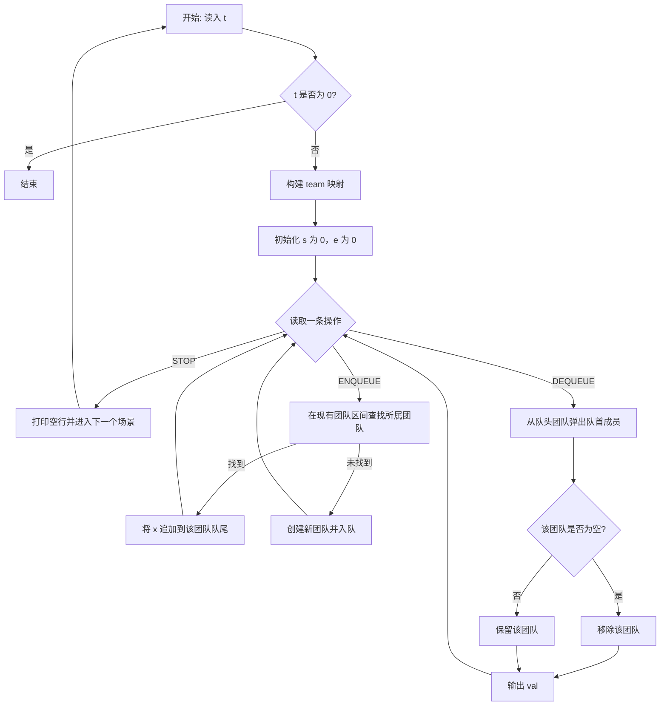

**C++ 标准模板库 (STL, Standard Template Library)**：包含一些常用数据结构与算法的模板的 C++ 软件库。其包含四个组件——算法 (Algorithms)、容器 (Containers)、仿函数 (Functors)、迭代器 (Iterators).

<!--more-->

示例：

- 算法：`sort(a.begin(), a.end())`
- 容器：`priority_queue<int> pque`
- 仿函数：`greater<int>()`
- 迭代器：`vector<int>::iterator it = a.begin()`


# 1 前言

STL 作为一个封装良好，性能合格的 C++ 标准库，在算法竞赛中运用极其常见。灵活且正确使用 STL 可以节省非常多解题时间，这一点不仅是由于可以直接调用，还是因为它封装良好，可以让代码的可读性变高，解题思路更清晰，调试过程 ~~往往~~ 更顺利。

不过 STL 毕竟使用了很多复杂的结构来实现丰富的功能，它的效率往往是比不上自己手搓针对特定题目的数据结构与算法的。因此，STL 的使用相当于使用更长的运行时间换取更高的编程效率。因此，在实际比赛中要权衡 STL 的利弊，不过这一点就得靠经验了。

接下来，我会分享在算法竞赛中常用的 STL 容器和算法，对于函数和迭代器，就不着重展开讲了。


# 2 常用容器

## 2.1 内容总览

打勾的是本次将会详细讲解的，加粗的是算法竞赛中有必要学习的。

- 顺序容器

  - [ ] **array**

  - [x] **vector**
  - [ ] **deque**
  - [ ] forward_list
  - [ ] **list**
- 关联容器

  - [x] **set**
  - [x] **map**
  - [ ] **multiset**
  - [ ] **multimap**
- 无序关联容器

  - [ ] **unordered_set**
  - [ ] **unordered_map**
  - [ ] **unordered_multiset**
  - [ ] **unordered_multimap**
- 容器适配器

  - [x] **stack**
  - [x] **queue**
  - [x] **priority_queue**
  - [ ] flat_set
  - [ ] flat_map
  - [ ] flat_multiset
  - [ ] flat_multimap
- 字符串
  - [x] **string** (basic_string\<char\>)

- 对与元组
  - [x] **pair**
  - [ ] **tuple**


## 2.2 向量 [vector](https://zh.cppreference.com/w/cpp/container/vector)

**`#include <vector>`**

连续的顺序的储存结构（和数组一样的类别），但是有长度可变的特性。

### 2.2.1 常用方法

#### 构造

**`vector<类型> arr(长度, [初值])`**

时间复杂度：$O(n)$

常用的一维和二维数组构造示例，高维也是一样的（就是会有点长）.

```cpp
vector<int> arr;         // 构造int数组
vector<int> arr(100);    // 构造初始长100的int数组
vector<int> arr(100, 1); // 构造初始长100的int数组，初值为1

vector<vector<int>> mat(100, vector<int> ());       // 构造初始100行，不指定列数的二维数组
vector<vector<int>> mat(100, vector<int> (666, -1)) // 构造初始100行，初始666列的二维数组，初值为-1
```

构造二维数组的奇葩写法，千万别用：

```cpp
vector<int> arr[100];         // 正确，构造初始100行，不指定列数的二维数组，可用于链式前向星存图
vector<int> arr[100](100, 1); // 语法错误！
vector<int> arr(100, 1)[100]; // 语法错误！
vector<int> arr[100] {{100, 1}, 这里省略98个 ,{100, 1}}; // 正确但奇葩，使用列表初始化
```

#### 尾接 & 尾删

- **`.push_back(元素)`**：在 vector 尾接一个元素，数组长度 $+1$.
- **`.pop_back()`**：删除 vector 尾部的一个元素，数组长度 $-1$

时间复杂度：均摊 $O(1)$

```cpp
// init: arr = []
arr.push_back(1);
// after: arr = [1]
arr.push_back(2);
// after: arr = [1, 2]
arr.pop_back();
// after: arr = [1]
arr.pop_back();
// after: arr = []
```

#### 中括号运算符

和一般数组一样的作用

时间复杂度：$O(1)$

#### 获取长度

**`.size()`**

获取当前 vector 的长度

时间复杂度：$O(1)$

```cpp
for (int i = 0; i < arr.size(); i++)
    cout << a[i] << endl;
```

#### 清空

**`.clear()`**

清空 vector

时间复杂度：$O(n)$

#### 判空

**`.empty()`**

如果是空返回 `true` 反之返回 `false`.

时间复杂度：$O(1)$

#### 改变长度

**`.resize(新长度, [默认值])`**

修改 vector 的长度

- 如果是缩短，则删除多余的值
- 如果是扩大，且指定了默认值，则新元素均为默认值 **（旧元素不变）**

时间复杂度：$O(n)$

### 2.2.2 适用情形

一般情况 `vector` 可以替换掉普通数组，除非该题卡常。

有些情况普通数组没法解决：$n\times m$ 的矩阵，$1\leq n,m\leq 10^6$ 且 $n\times m \leq 10^6$

- 如果用普通数组 `int mat[1000010][1000010]`，浪费内存，会导致 MLE。
- 如果使用 `vector<vector<int>> mat(n + 10, vector<int> (m + 10))`，完美解决该问题。

另外，`vector` 的数据储存在堆空间中，不会爆栈。

### 2.2.3 注意事项

#### 提前指定长度

如果长度已经确定，那么应当直接在构造函数指定长度，而不是一个一个 `.push_back()`. 因为 `vector` 额外内存耗尽后的重分配是有时间开销的，直接指定长度就不会出现重分配了。

```cpp
// 优化前: 522ms
vector<int> a;
for (int i = 0; i < 1e8; i++)
    a.push_back(i);
// 优化后: 259ms
vector<int> a(1e8);
for (int i = 0; i < a.size(); i++)
    a[i] = i;
```

#### 当心 size_t 溢出

vector 获取长度的方法 `.size()` 返回值类型为 `size_t`，通常 OJ 平台使用的是 32 位编译器（有些平台例如 cf 可选 64 位），那么该类型范围为 $[0,2^{32})$.

```cpp
vector<int> a(65536);
long long a = a.size() * a.size(); // 直接溢出变成0了
```

## 2.3 栈 [stack](https://zh.cppreference.com/w/cpp/container/stack)

**`#include <stack>`**

通过二次封装双端队列 (deque) 容器，实现先进后出的栈数据结构。

### 2.3.1 常用方法

| 作用                   | 用法              | 示例                 |
| ---------------------- | ----------------- | -------------------- |
| 构造                   | `stack<类型> stk` | `stack<int> stk;`    |
| 进栈                   | `.push(元素)`     | `stk.push(1);`       |
| 出栈                   | `.pop()`          | `stk.pop();`         |
| 取栈顶                 | `.top()`          | `int a = stk.top();` |
| 查看大小 / 清空 / 判空 | 略                | 略                   |

### 2.3.2 适用情形

如果不卡常的话，就可以直接用它而不需要手写栈了。

另外，vector 也可以当栈用，vector 的 `.back()` 取尾部元素，就相当于取栈顶，`.push_back()` 相当于进栈，`.pop_back()` 相当于出栈。

### 2.3.3 注意事项

不可访问内部元素！**下面都是错误用法**

```cpp
for (int i = 0; i < stk.size(); i++)
    cout << stk[i] << endl;
for (auto ele : stk)
    cout << stk << endl;
```

## 2.4 队列 [queue](https://zh.cppreference.com/w/cpp/container/queue)

**`#include <queue>`**

通过二次封装双端队列 (deque) 容器，实现先进先出的队列数据结构。

### 2.4.1 常用方法

| 作用                   | 用法              | 示例                   |
| ---------------------- | ----------------- | ---------------------- |
| 构造                   | `queue<类型> que` | `queue<int> que;`      |
| 进队                   | `.push(元素)`     | `que.push(1);`         |
| 出队                   | `.pop()`          | `que.pop();`           |
| 取队首                 | `.front()`        | `int a = que.front();` |
| 取队尾                 | `.back()`         | `int a = que.back();`  |
| 查看大小 / 清空 / 判空 | 略                | 略                     |

### 2.4.2 适用情形

如果不卡常的话，就可以直接用它而不需要手写队列了。

### 2.4.3 注意事项

不可访问内部元素！**下面都是错误用法**

```cpp
for (int i = 0; i < que.size(); i++)
    cout << que[i] << endl;
for (auto ele : que)
    cout << ele << endl;
```

## 2.5 优先队列 [priority_queue](https://zh.cppreference.com/w/cpp/container/priority_queue)

**`#include <queue>`**

提供常数时间的最大元素查找，对数时间的插入与提取，底层原理是二叉堆。

### 2.5.1 常用方法

#### 构造

**`priority_queue<类型, 容器, 比较器> pque`**

- 类型：要储存的数据类型
- 容器：储存数据的底层容器，默认为 `vector<类型>`，竞赛中保持默认即可
- 比较器：比较大小使用的比较器，默认为 `less<类型>`，可自定义

```cpp
priority_queue<int> pque1;                            // 储存int的大顶堆
priority_queue<int, vector<int>, greater<int>> pque2; // 储存int的小顶堆
```

> 对于需要自定义比较器的情况，涉及一些初学时容易看迷糊的语法（重载小括号运算符 / lambda 表达式），在此就不展开讲了。如果想要了解，可以查阅 cppreference 中的代码示例。

#### 其他

| 作用            | 用法          | 示例                 |
| --------------- | ------------- | -------------------- |
| 进堆            | `.push(元素)` | `que.push(1);`       |
| 出堆            | `.pop()`      | `que.pop();`         |
| 取堆顶          | `.top()`      | `int a = que.top();` |
| 查看大小 / 判空 | 略            | 略                   |

进出队复杂度 $O(\log n)$，取堆顶 $O(1)$.

### 2.5.2 适用情形

持续维护元素的有序性：每次向队列插入大小不定的元素，或者每次从队列里取出大小最小/最大的元素，元素数量 $n$，插入操作数量 $k$.

- 每次插入后进行快速排序：$k\cdot n\log n$
- 使用优先队列维护：$k\cdot\log n$

### 2.5.3 注意事项

#### 仅堆顶可读

只可访问堆顶，其他元素都无法读取到。**下面是错误用法：**

```cpp
cout << pque[1] << endl;
```

#### 所有元素不可写

堆中所有元素是不可修改的。**下面是错误用法：**

```cpp
pque[1] = 2;
pque.top() = 1;
```

如果你恰好要修改的是堆顶元素，那么是可以完成的：

```cpp
int tp = pque.top();
pque.pop();
pque.push(tp + 1);
```

## 2.6 集合 [set](https://zh.cppreference.com/w/cpp/container/set)

**`#include <set>`**

提供对数时间的插入、删除、查找的集合数据结构。底层原理是红黑树。

| 集合三要素 | 解释                           | set           | multiset      | unordered_set |
| ---------- | ------------------------------ | ------------- | ------------- | ------------- |
| 确定性     | 一个元素要么在集合中，要么不在 | ✔             | ✔             | ✔             |
| 互异性     | 一个元素仅可以在集合中出现一次 | ✔             | ❌（任意次）   | ✔             |
| 无序性     | 集合中的元素是没有顺序的       | ❌（从小到大） | ❌（从小到大） | ✔             |

### 2.6.1 常用方法

#### 构造

**`set<类型, 比较器> st`**

- 类型：要储存的数据类型
- 比较器：比较大小使用的比较器，默认为 `less<类型>`，可自定义

```cpp
set<int> st1;               // 储存int的集合（从小到大）
set<int, greater<int>> st2; // 储存int的集合（从大到小）
```

> 对于需要自定义比较器的情况，涉及一些初学时容易看迷糊的语法（重载小括号运算符 / lambda 表达式），在此就不展开讲了。

#### 查找
```cpp
if (st.find(val) != st.end()){};
//还可以用count（val）返回有几个val，根据互异性，只可能有0，1两种返回值；
if(st.count(2)){};
```

#### 遍历

可使用迭代器进行遍历：

```cpp
for (set<int>::iterator it = st.begin(); it != st.end(); ++it)
    cout << *it << endl;
```

基于范围的循环（C++ 11）：

```cpp
for (auto &ele : st)
    cout << ele << endl;
```

#### 其他

| 作用                   | 用法            | 示例                    |
| ---------------------- | --------------- | ----------------------- |
| 插入元素               | `.insert(元素)` | `st.insert(1);`         |
| 删除元素               | `.erase(元素)`  | `st.erase(2);`          |
| 查找元素               | `.find(元素)`   | `auto it = st.find(1);` |
| 判断元素是否存在       | `.count(元素)`  | `st.count(3);`          |
| 查看大小 / 清空 / 判空 | 略              | 略                      |

增删查时间复杂度均为 $O(\log n)$

### 2.6.2 适用情形

- 元素去重：$[1,1,3,2,4,4]\to[1,2,3,4]$
- 维护顺序：$[1,5,3,7,9]\to[1,3,5,7,9]$
- 元素是否出现过：元素大小 $[-10^{18},10^{18}]$，元素数量 $10^6$，vis 数组无法实现，通过 set 可以完成。

### 2.6.3 注意事项

#### 不存在下标索引

set 虽说可遍历，但仅可使用迭代器进行遍历，它不存在下标这一概念，无法通过下标访问到数据。**下面是错误用法：**

```cpp
cout << st[0] << endl;
```

#### 元素只读

set 的迭代器取到的元素是只读的（因为是 const 迭代器），不可修改其值。如果要改，需要先 erase 再 insert. **下面是错误用法：**

```cpp
cout << *st.begin() << endl; // 正确。可读。
*st.begin() = 1;             // 错误！不可写！
```

#### 不可用迭代器计算下标

set 的迭代器不能像 vector 一样相减得到下标。**下面是错误用法：**

```cpp
auto it = st.find(2);      // 正确，返回2所在位置的迭代器。
int idx = it - st.begin(); // 错误！不可相减得到下标。
```

## 2.7 映射 [map](https://zh.cppreference.com/w/cpp/container/map)

**`#include <map>`**

提供对数时间的有序键值对结构。底层原理是红黑树。

映射：
$$
\begin{matrix}
1&\to&2\\
2&\to&2\\
3&\to&1\\
4&\to&5\\
&\vdots
\end{matrix}
$$

| 性质   | 解释                         | map           | multimap      | unordered_map |
| ------ | ---------------------------- | ------------- | ------------- | ------------- |
| 互异性 | 一个键仅可以在映射中出现一次 | ✔             | ❌（任意次）   | ✔             |
| 无序性 | 键是没有顺序的               | ❌（从小到大） | ❌（从小到大） | ✔             |

### 2.7.1 常用方法

#### 构造

**`map<键类型, 值类型, 比较器> mp`**

- 键类型：要储存键的数据类型
- 值类型：要储存值的数据类型
- 比较器：键比较大小使用的比较器，默认为 `less<类型>`，可自定义

```cpp
map<int, int> mp1;               // int->int 的映射（键从小到大）
map<int, int, greater<int>> st2; // int->int 的映射（键从大到小）
```

> 对于需要自定义比较器的情况，涉及一些初学时容易看迷糊的语法（重载小括号运算符 / lambda 表达式），在此就不展开讲了。

#### 遍历

可使用迭代器进行遍历：

```cpp
for (map<int, int>::iterator it = mp.begin(); it != mp.end(); ++it)
    cout << it->first << ' ' << it->second << endl;
```

基于范围的循环（C++ 11）：

```cpp
for (auto &pr : mp)
    cout << pr.first << ' ' << pr.second << endl;
```

结构化绑定 + 基于范围的循环（C++17）：

```cpp
for (auto &[key, val] : mp)
    cout << key << ' ' << val << endl;
```

#### 其他

| 作用                   | 用法           | 示例                    |
| ---------------------- | -------------- | ----------------------- |
| 增 / 改 / 查元素       | 中括号         | `mp[1] = 2;`            |
| 查元素（返回迭代器）   | `.find(元素)`  | `auto it = mp.find(1);` |
| 删除元素               | `.erase(元素)` | `mp.erase(2);`          |
| 判断元素是否存在       | `.count(元素)` | `mp.count(3);`          |
| 查看大小 / 清空 / 判空 | 略             | 略                      |

增删改查时间复杂度均为 $O(\log n)$

### 2.7.2 适用情形

需要维护映射的场景可以使用：输入若干字符串，统计每种字符串的出现次数。(`map<string, int> mp`)

### 2.7.3 注意事项

#### 中括号访问时默认值

如果使用中括号访问 map 时对应的键不存在，那么会新增这个键，并且值为默认值，因此中括号会影响键的存在性。

```cpp
map<char, int> mp;
cout << mp.count('a') << endl; // 0
mp['a'];                       // 即使什么都没做，此时mp['a']=0已经插入了
cout << mp.count('a') << endl; // 1
cout << mp['a'] << endl;       // 0
```

#### 不可用迭代器计算下标

map 的迭代器不能像 vector 一样相减得到下标。**下面是错误用法：**

```cpp
auto it = mp.find('a');      // 正确，返回2所在位置的迭代器。
int idx = it - mp.begin();   // 错误！不可相减得到下标。
```

## 2.8 字符串 [string](https://zh.cppreference.com/w/cpp/string)

**`#include <string>`**

顾名思义，就是储存字符串的。

### 2.8.1 常用方法

#### 构造

构造函数：`string(长度, 初值)`

```cpp
string s1;           // 构造字符串，为空
string s2 = "awa!";  // 构造字符串，并赋值awa!
string s3(10, '6');  // 构造字符串，通过构造函数构造为6666666666
```

#### 输入输出

C++

```cpp
string s;
cin >> s;
cout << s;
```

C

```cpp
string s;
char buf[100];
scanf("%s", &buf);
s = buf;
printf("%s", s.c_str());
```

#### 其他

| 作用                   | 用法                          | 示例                            |
| ---------------------- | ----------------------------- | ------------------------------- |
| 修改、查询指定下标字符 | `[]`                          | `s[1] = 'a';`                   |
| 是否相同               | `==`                          | `if (s1 == s2) ...`             |
| 字符串连接             | `+`                           | `string s = s1 + s2;`           |
| 尾接字符串             | `+=`                          | `s += "awa";`                   |
| 取子串                 | `.substr(起始下标, 子串长度)` | `string sub = s.substr(2, 10);` |
| 查找字符串             | `.find(字符串, 起始下标)`     | `int pos = s.find("awa");`      |


#### 数值与字符串互转（C++11）

| 源                                             | 目的        | 函数        |
| ---------------------------------------------- | ----------- | ----------- |
| int / long long / float / double / long double | string      | to_string() |
| string                                         | int         | stoi()      |
| string                                         | long long   | stoll()     |
| string                                         | float       | stof()      |
| string                                         | double      | stod()      |
| string                                         | long double | stold()     |

### 2.8.2 适用情形

非常好用！~~建议直接把字符数组扔了，赶快投入 string 的怀抱。~~

### 2.8.3 注意事项

#### 尾接字符串一定要用 `+=`

string 的 += 运算符，将会在原字符串原地尾接字符串。而 + 了再 = 赋值，会先生成一个临时变量，在复制给 string.

通常字符串长度可以很长，如果使用 + 字符串很容易就 TLE 了。

```cpp
// 优化前: 15139ms
string s;
for (int i = 0; i < 5e5; i++)
    s = s + "a";

// 优化后: < 1ms (计时器显示0)
string s;
for (int i = 0; i < 5e5; i++)
    s += "a";
```

#### `.substr()` 方法的奇葩参数

一定要注意，C++ string 的取子串的第一个参数是**子串起点下标**，第二个参数是**子串长度**。

第二个参数不是子串终点！不是子串终点！要与 java 等其他语言区分开来。

#### `.find()` 方法的复杂度

该方法实现为暴力实现，时间复杂度为 $O(n^2)$.

~~不要幻想 STL 内置了个 $O(n)$ 的 KMP 算法~~

## 2.9 二元组 [pair](https://zh.cppreference.com/w/cpp/utility/pair)

**`#include <utility>`**

顾名思义，就是储存二元组的。

### 2.9.1 常用方法

#### 构造

**`pair<第一个值类型, 第二个值类型> pr`**

- 第一个值类型：要储存的第一个值的数据类型
- 第二个值类型：要储存的第二个值的数据类型

```cpp
pair<int, int> p1;
pair<int, long long> p2;
pair<char, int> p3;
// ...
```

#### 赋值

老式

```cpp
pair<int, char> pr = make_pair(1, 'a');
```

列表构造 C++11

```cpp
pair<int, char> pr = {1, 'a'};
```

#### 取值

直接取值

- 取第一个值：`.first`
- 取第二个值：`.second`

```cpp
pair<int, char> pr = {1, 'a'};
int awa = pr.first;
char bwb = pr.second;
```

结构化绑定 C++17

```cpp
pair<int, char> pr = {1, 'a'};
auto &[awa, bwb] = pr;
```

#### 判同

直接用 `==` 运算符

```cpp
pair<int, int> p1 = {1, 2};
pair<int, int> p2 = {1, 3};
if (p1 == p2) { ... } // false
```

### 2.9.2 适用场景

所有需要二元组的场景均可使用，效率和自己定义结构体差不多。

### 2.9.3 注意事项

无


# 3 迭代器简介

## 3.1 迭代器是什么？

不搞抽象，直接举例。

对于一个 vector，我们可以用下标遍历：

```cpp
for (int i = 0; i < a.size(); i++)
    cout << a[i] << endl;
```

我们同时也可以用迭代器来遍历：

```cpp
for (vector<int>::iterator it = a.begin(); it != a.end(); ++it)
    cout << *it << endl;
```

- `a.begin()` 是一个迭代器，指向的是第一个元素
- `a.end()` 是一个迭代器，指向的是最后一个元素**再后面一位**
- 上述迭代器具有自增运算符，自增则迭代器向下一个元素移动
- 迭代器与指针相似，如果对它使用解引用运算符，即 `*it`，就能取到对应值了

## 3.2 为何需要迭代器？

很多数据结构并不是线性的（例如红黑树），对于非线性数据结构，下标是无意义的。无法使用下标来遍历整个数据结构。

迭代器的作用就是定义某个数据结构的遍历方式，通过迭代器的增减，代表遍历到的位置，通过迭代器便能成功遍历非线性结构了。

例如，set 的实现是红黑树，我们是没法用下标来访问元素的。但是通过迭代器，我们就能遍历 set 中的元素了：

```cpp
for (set<int>::iterator it = st.begin(); it != st.end(); ++it)
    cout << *it << endl;
```

## 3.3 迭代器用法

对于 vector 容器，它的迭代器功能比较完整，以它举例：

- `.begin()`：头迭代器
- `.end()`：尾迭代器
- `.rbegin()`：反向头迭代器
- `.rend()`：反向尾迭代器
- 迭代器 `+` 整型：将迭代器向后移动
- 迭代器 `-` 整型：将迭代器向前移动
- 迭代器 `++`：将迭代器向后移动 1 位
- 迭代器 `--`：将迭代器向前移动 1 位
- 迭代器 `-` 迭代器：两个迭代器的距离
- `prev(it)`：返回 it 的前一个迭代器
- `next(it)`：返回 it 的后一个迭代器

对于其他容器，由于其结构特性，上面的功能不一定都有（例如 **set** 的迭代器是不能相减求距离的）

## 3.4 常见问题

**`.end()` 和 `.rend()` 指向的位置是无意义的值**

对于一个长度为 10 的数组：`for (int i = 0; i < 10; i++)`，第 10 位是不可访问的

对于一个长度为 10 的容器：`for (auto it = a.begin(); it != a.end(); ++it)`，.end 是不可访问的

**不同容器的迭代器功能可能不一样**

迭代器细化的话有正向、反向、双向，每个容器的迭代器支持的运算符也可能不同，因此不同容器的迭代器细节很有可能是不一样的。

**删除操作时需要警惕**

为什么 3 没删掉？

```cpp
vector<int> a{1, 2, 3, 4};
for (auto it = a.begin(); it != a.end(); ++it)
    if (*it == 2 || *it == 3)
        a.erase(it);
// a = [1, 3, 4]
```

为啥 RE 了？

```cpp
vector<int> a{1, 2, 3, 4};
for (auto it = a.begin(); it != a.end(); ++it)
    if (*it == 4)
        a.erase(it);
    //删了4，前移一位，it = a.end(),然后自增后越界
```

<center><b>建议：如无必要，别用迭代器操作容器。（遍历与访问没关系）</b></center>


# 4 常用算法

## 4.1 内容总览

打勾的是本次将会详细讲解的，其他的是算法竞赛中建议学习的，不在下表列出的在比赛中基本用不到。

（很多函数的功能很简单，自己都能快速写出来，但是使用函数可以让代码可读性变得更高，这在比赛中是至关紧要的）

- 算法库 Algorithm

  - [ ] `count()`
  - [ ] `find()`
  - [ ] `fill()`
  - [x] [`swap()`](https://zh.cppreference.com/w/cpp/algorithm/swap)
  - [x] [`reverse()`](https://zh.cppreference.com/w/cpp/algorithm/reverse)
  - [ ] `shuffle()` C++11
  - [x] [`unique()`](https://zh.cppreference.com/w/cpp/algorithm/unique)
  - [x] [`sort()`](https://zh.cppreference.com/w/cpp/algorithm/sort)
  - [x] [`lower_bound()`](https://zh.cppreference.com/w/cpp/algorithm/lower_bound) / [`upper_bound()`](https://zh.cppreference.com/w/cpp/algorithm/upper_bound)
  - [x] [`max()`](https://zh.cppreference.com/w/cpp/algorithm/max) / [`min()`](https://zh.cppreference.com/w/cpp/algorithm/min)
  - [ ] `max_element()` / `min_element()`
  - [ ] `prev_permutation()` / `next_permutation()`
- 数学函数 cmath
  - [x] [`abs()`](https://zh.cppreference.com/w/cpp/numeric/math/fabs)
  - [x] [`exp()`](https://zh.cppreference.com/w/cpp/numeric/math/exp)
  - [x] [`log()`](https://zh.cppreference.com/w/cpp/numeric/math/log) / `log10()` / `log2()`
  - [x] [`pow()`](https://zh.cppreference.com/w/cpp/numeric/math/pow)
  - [x] [`sqrt()`](https://zh.cppreference.com/w/cpp/numeric/math/sqrt)
  - [ ] `sin()` / `cos()` / `tan()`
  - [ ] `asin()` / `acos()` / `atan()`
  - [ ] `sinh()` / `cosh()` / `tanh()`
  - [ ] `asinh()` / `acosh()` / `atanh()` C++11
  - [x] [`ceil()`](https://zh.cppreference.com/w/cpp/numeric/math/ceil) / [`floor()`](https://zh.cppreference.com/w/cpp/numeric/math/floor)
  - [x] [`round()`](https://zh.cppreference.com/w/cpp/numeric/math/round) C++11
- 数值算法 numeric
  - [ ] `iota()` C++11
  - [ ] `accumulate()`
  - [x] [`gcd()`](https://zh.cppreference.com/w/cpp/numeric/gcd) C++17
  - [x] [`lcm()`](https://zh.cppreference.com/w/cpp/numeric/lcm) C++17
- 伪随机数生成 random
  - [ ] `mt19937`
  - [ ] `random_device()`

## 4.2 `swap()`

交换两个变量的值

**用法示例**

```cpp
template< class T >
void swap( T& a, T& b );
```

```cpp
int a = 0, b = 1;
swap(a, b);
// now a = 1, b = 0

int arr[10] {0, 1, 2, 3, 4, 5, 6, 7, 8, 9};
swap(arr[4], arr[6]);
// now arr = {0, 1, 2, 3, 6, 5, 4, 7, 8, 9}
```

**注意事项**

这个 swap 参数是引用的，不需要像 C 语言一样取地址。

## 4.3 `sort()`

使用快速排序给一个可迭代对象排序

**用法示例**

```cpp
template< class RandomIt, class Compare >
void sort( RandomIt first, RandomIt last, Compare comp );
```

默认排序从小到大

```cpp
vector<int> arr{1, 9, 1, 9, 8, 1, 0};
sort(arr.begin(), arr.end());
// arr = [0, 1, 1, 1, 8, 9, 9]
```

如果要从大到小，则需要传比较器进去。

```cpp
vector<int> arr{1, 9, 1, 9, 8, 1, 0};
sort(arr.begin(), arr.end(), greater<int>());
// arr = [9, 9, 8, 1, 1, 1, 0]
```

如果需要完成特殊比较，则需要手写比较器。

比较器函数返回值是 bool 类型，传参是需要比较的两个元素。记我们定义的该比较操作为 $\star$：

- 若 $a\star b$，则比较器函数应当返回 `true`
- 若 $a\not\star b$，则比较器函数应当返回 `false`

**注意：**如果 $a=b$，比较器函数必须返回 `false`

**例：** 要求对多个二元组进行如下排序：按照第二个数从小到大排；如果第二个数相同，则按照第一个数从大到小排；
```cpp
bool cmp(pair<int, int> a, pair<int, int> b)
{
    if (a.second != b.second)
        return a.second < b.second;
    return a.first > b.first;
}

int main()
{
    vector<pair<int, int>> arr{{1, 9}, {2, 9}, {8, 1}, {0, 0}};
	sort(arr.begin(), arr.end(), cmp);
    // arr = [(0, 0), (8, 1), (2, 9), (1, 9)]
}
```

## 4.4 `lower_bound()` / `upper_bound()`

在**已升序排序**的元素中，应用二分查找检索指定元素，返回对应元素迭代器位置。**找不到则返回尾迭代器。**

- `lower_bound()`: 寻找 $\geq x$ 的第一个元素的位置
- `upper_bound()`: 寻找 $>x$ 的第一个元素的位置

怎么找 $\leq x$ / $< x$ 的第一个元素呢？

- $>x$ 的第一个元素的前一个元素（如果有）便是 $\leq x$ 的第一个元素
- $\geq x$ 的第一个元素的前一个元素（如果有）便是 $<x$ 的第一个元素

返回的是迭代器，如何转成下标索引呢？减去头迭代器即可。

**示例**

```cpp
template< class ForwardIt, class T >
ForwardIt lower_bound( ForwardIt first, ForwardIt last, const T& value );
```

```cpp
vector<int> arr{0, 1, 1, 1, 8, 9, 9};
vector<int>::iterator it = lower_bound(arr.begin(), arr.end(), 7);
int idx = it - arr.begin();
// idx = 4
```

我们通常写成一行：

```cpp
vector<int> arr{0, 1, 1, 1, 8, 9, 9};
idx = lower_bound(arr.begin(), arr.end(), 7) - arr.begin(); // 4
idx = lower_bound(arr.begin(), arr.end(), 8) - arr.begin(); // 4
idx = upper_bound(arr.begin(), arr.end(), 7) - arr.begin(); // 4
idx = upper_bound(arr.begin(), arr.end(), 8) - arr.begin(); // 5
```

## 4.5 `reverse()`

反转一个可迭代对象的元素顺序

**用法示例**

```cpp
template< class BidirIt >
void reverse( BidirIt first, BidirIt last );
```

```cpp
vector<int> arr(10);
iota(arr.begin(), arr.end(), 1);
// 1, 2, 3, 4, 5, 6, 7, 8, 9, 10
reverse(arr.begin(), arr.end());
// 10, 9, 8, 7, 6, 5, 4, 3, 2, 1
```

## 4.6 `max()` / `min()`

返回最大值 / 最小值的**数值**

**用法示例**

```cpp
int mx = max(1, 2); // 2
int mn = min(1, 2); // 1
```

在 C++11 之后，可以使用列表构造语法传入一个列表，这样就能一次性给多个元素找最大值而不用套娃了：

```cpp
// Before C++11
int mx = max(max(1, 2), max(3, 4)); // 4
int mn = min(min(1, 2), min(3, 4)); // 1

// After C++11
int mx = max({1, 2, 3, 4}); // 4
int mn = min({1, 2, 3, 4}); // 1
```

## 4.7 `unique()`

消除数组的重复**相邻**元素，数组长度不变，但是有效数据缩短，返回的是有效数据位置的结尾迭代器。

例如：$[1,1,4,5,1,4]\to[1,4,5,1,4,\underline?]$，下划线位置为返回的迭代器指向。

```cpp
template< class ForwardIt >
ForwardIt unique( ForwardIt first, ForwardIt last );
```

**用法示例**

单独使用 unique 并不能达成去重效果，因为它只消除**相邻**的重复元素。但是如果序列有序，那么它就能去重了。

但是它去重后，序列尾部会产生一些无效数据：$[1,1,2,4,4,4,5]\to[1,2,4,5,\underline?,?,?]$，为了删掉这些无效数据，我们需要结合 erase.

最终，给 vector 去重的写法便是：

```cpp
vector<int> arr{1, 2, 1, 4, 5, 4, 4};
sort(arr.begin(), arr.end());
// sort 后  1 1 2 4 4 4 5
//unique后  1 2 4 5 指向->4 4 5 
arr.erase(unique(arr.begin(), arr.end()), arr.end());
//unique返回的是指向去重后容器中不重复序列末尾的下一个位置的迭代器。
```

## 4.8 数学函数

所有函数参数均支持 `int` / `long long` / `float` / `double` / `long double`

| 公式                    | 示例         |
| ----------------------- | ------------ |
| $f(x)=\lvert x\rvert$   | `abs(-1.0)`  |
| $f(x)=e^x$              | `exp(2)`     |
| $f(x)=\ln x$            | `log(3)`     |
| $f(x,y)=x^y$            | `pow(2, 3)`  |
| $f(x)=\sqrt x$          | `sqrt(2)`    |
| $f(x)=\lceil x\rceil$   | `ceil(2.1)`  |
| $f(x)=\lfloor x\rfloor$ | `floor(2.1)` |
| $f(x)=\left<x\right>$   | `round(2.1)` |

**注意事项**
## 浮点数误差问题

在《算法竞赛入门经典》第二章例题2-1中提到，浮点数运算存在精度误差。例如，整数 1 可能因为误差变成 0.999999999，此时 `floor` 的结果会是 0 而非预期的 1。为避免这类问题，可以使用四舍五入：`floor(sqrt(x) + 0.5)`。

**更重要的是**：当操作数都是整型时，应当避免使用浮点数运算，直接使用整数运算更加稳妥和精确，可以避免因浮点误差导致的 WA（Wrong Answer）。

> 参考：https://codeforces.com/blog/entry/107717

### 推荐的整数运算写法

#### 1. 向下取整除法 $\lfloor\frac{a}{b}\rfloor$
- ❌ 别用：`floor(1.0 * a / b)`
- ✅ 要用：`a / b`
- 示例：
```cpp
int a = 7, b = 3;
int result = a / b;  // 结果为 2
```

#### 2. 向上取整除法 $\lceil\frac{a}{b}\rceil$
- ❌ 别用：`ceil(1.0 * a / b)`
- ✅ 要用：`(a + b - 1) / b`（基于公式：$\lceil\frac{a}{b}\rceil=\lfloor\frac{a+b-1}{b}\rfloor$）
- 示例：
```cpp
int a = 7, b = 3;
int result = (a + b - 1) / b;  // 结果为 3
```

#### 3. 平方根向下取整 $\lfloor\sqrt a\rfloor$
- ❌ 别用：`(int) sqrt(a)`
- ✅ 要用：[二分查找](https://oiwiki.com/basic/binary/)
- 示例：
```cpp
// 二分查找计算 floor(sqrt(n))
int isqrt(int n) {
    int l = 0, r = n;
    while (l < r) {
        int mid = l + (r - l + 1) / 2;
        if (mid <= n / mid) l = mid;  // 避免 mid * mid 溢出
        else r = mid - 1;
    }
    return l;
}
```

#### 4. 整数幂运算 $a^b$
- ❌ 别用：`pow(a, b)`
- ✅ 要用：[快速幂](https://oiwiki.com/math/binary-exponentiation/)
- 示例：
```cpp
// 快速幂计算 a^b
long long qpow(long long a, long long b) {
    long long res = 1;
    while (b) {
        if (b & 1) res *= a;
        a *= a;
        b >>= 1;
    }
    return res;
}
```

#### 5. 以2为底的对数向下取整 $\lfloor\log_2 a\rfloor$
- ❌ 别用：`log2(a)`
- ✅ 要用：`__lg(a)` 或 `bit_width(a) - 1`（C++20）
- 示例：
```cpp
int a = 15;
int result = __lg(a);  // 结果为 3，因为 log2(15) ≈ 3.9
// C++20: int result = std::bit_width((unsigned)a) - 1;
```

## 4.9 `gcd()` / `lcm()`

（C++17）返回最大公因数 / 最小公倍数

```cpp
int x = gcd(8, 12); // 4
int y = lcm(8, 12); // 24
```

如果不是 C++17，但是是 GNU 编译器（g++），那么可以用内置函数 `__gcd()`.

当然，`gcd` / `lcm` 函数也挺好写，直接写也行（欧几里得算法）：

```cpp
int gcd(int a, int b)
{
    if (!b)
        return a;
    return gcd(b, a % b);
}

int lcm(int a, int b)
{
    return a / gcd(a, b) * b;
}
```
---


# 5 其他常用容器

本章节补充了一些在算法竞赛中也较为常用的容器，虽然使用频率不如前面章节的容器，但在特定场景下非常有用。

## 5.1 数组 [array](https://zh.cppreference.com/w/cpp/container/array)

**`#include <array>`**

固定长度的顺序容器，在编译期就确定大小，性能接近原生数组，但提供了 STL 容器的接口。

### 5.1.1 常用方法

#### 构造

**`array<类型, 长度> arr`**

注意：长度必须是编译期常量。

时间复杂度：$O(1)$

```cpp
array<int, 5> arr1;              // 构造长度为5的int数组，未初始化
array<int, 5> arr2 = {1, 2, 3};  // 构造并初始化前3个元素，后2个为0
array<int, 5> arr3{};            // 构造并全部初始化为0
```

#### 访问元素

**中括号运算符 `[]`** 和 **`.at()`**

时间复杂度：$O(1)$

```cpp
array<int, 5> arr = {1, 2, 3, 4, 5};
cout << arr[0] << endl;     // 1, 不检查越界
cout << arr.at(0) << endl;  // 1, 检查越界，越界会抛出异常
```

#### 获取首尾元素

- **`.front()`**：返回第一个元素
- **`.back()`**：返回最后一个元素

时间复杂度：$O(1)$

#### 获取长度

**`.size()`**

时间复杂度：$O(1)$

#### 填充

**`.fill(值)`**

将所有元素设置为指定值

时间复杂度：$O(n)$

```cpp
array<int, 5> arr;
arr.fill(0);  // 所有元素设为0
```

### 5.1.2 适用情形

- 长度在编译期已知且固定的场景
- 需要 STL 接口但又追求性能的场景
- 相比普通数组，array 可以作为函数返回值、支持赋值操作

### 5.1.3 注意事项

#### 长度必须是常量

```cpp
int n = 10;
array<int, n> arr;       // 错误！n不是编译期常量
array<int, 10> arr;      // 正确
const int N = 10;
array<int, N> arr;       // 正确
```

#### 不能动态改变大小

array 的大小在编译期确定，无法像 vector 那样动态增长。

## 5.2 双端队列 [deque](https://zh.cppreference.com/w/cpp/container/deque)

**`#include <deque>`**

双端队列（double-ended queue），支持在头尾两端高效插入和删除的顺序容器。

### 5.2.1 常用方法

#### 构造

**`deque<类型> dq`**

```cpp
deque<int> dq;          // 构造空双端队列
deque<int> dq(10);      // 构造长度为10的双端队列
deque<int> dq(10, 1);   // 构造长度为10，初值为1的双端队列
```

#### 头尾操作

- **`.push_front(元素)`**：在头部插入元素
- **`.push_back(元素)`**：在尾部插入元素
- **`.pop_front()`**：删除头部元素
- **`.pop_back()`**：删除尾部元素
- **`.front()`**：访问头部元素
- **`.back()`**：访问尾部元素

时间复杂度：均为 $O(1)$

```cpp
deque<int> dq;
dq.push_back(1);   // dq = [1]
dq.push_front(2);  // dq = [2, 1]
dq.push_back(3);   // dq = [2, 1, 3]
int x = dq.front(); // x = 2
dq.pop_front();    // dq = [1, 3]
```

#### 随机访问

**中括号运算符 `[]`**

时间复杂度：$O(1)$

#### 其他

- **`.size()`**：获取长度
- **`.empty()`**：判空
- **`.clear()`**：清空

### 5.2.2 适用情形

- 需要在两端进行插入删除操作的场景
- 单调队列的实现
- 滑动窗口问题

### 5.2.3 注意事项

#### 性能不如 vector

deque 虽然支持随机访问，但性能不如 vector，因为其内存不是完全连续的。如果只需要尾部操作，优先使用 vector。

## 5.3 链表 [list](https://zh.cppreference.com/w/cpp/container/list)

**`#include <list>`**

双向链表，支持在任意位置快速插入和删除，但不支持随机访问。

### 5.3.1 常用方法

#### 构造

**`list<类型> lst`**

```cpp
list<int> lst;          // 构造空链表
list<int> lst(10);      // 构造10个元素的链表
list<int> lst(10, 1);   // 构造10个元素，初值为1
```

#### 头尾操作

- **`.push_front(元素)`**：在头部插入
- **`.push_back(元素)`**：在尾部插入
- **`.pop_front()`**：删除头部元素
- **`.pop_back()`**：删除尾部元素
- **`.front()`**：访问头部元素
- **`.back()`**：访问尾部元素

时间复杂度：均为 $O(1)$

#### 插入和删除

- **`.insert(迭代器, 元素)`**：在指定位置前插入
- **`.erase(迭代器)`**：删除指定位置元素

时间复杂度：$O(1)$（需要先通过遍历找到位置）

#### 其他操作

- **`.sort()`**：对链表排序
- **`.reverse()`**：反转链表
- **`.unique()`**：去除相邻重复元素
- **`.merge(另一个list)`**：合并两个有序链表

### 5.3.2 适用情形

- 频繁在中间位置插入删除的场景
- 不需要随机访问的场景
- 实际竞赛中很少使用，一般用 vector 或 deque 代替

### 5.3.3 注意事项

#### 不支持随机访问

```cpp
list<int> lst = {1, 2, 3, 4, 5};
cout << lst[2] << endl;  // 错误！不支持下标访问
```

#### 性能开销

链表的节点不连续，缓存性能差，在竞赛中一般不推荐使用。

## 5.4 多重集合 [multiset](https://zh.cppreference.com/w/cpp/container/multiset)

**`#include <set>`**

与 set 类似，但允许元素重复出现。底层原理是红黑树。

### 5.4.1 常用方法

#### 构造

**`multiset<类型, 比较器> mst`**

```cpp
multiset<int> mst;               // 从小到大
multiset<int, greater<int>> mst; // 从大到小
```

#### 插入和删除

- **`.insert(元素)`**：插入元素（允许重复）
- **`.erase(元素)`**：删除**所有**等于该元素的值
- **`.erase(迭代器)`**：删除迭代器指向的单个元素

时间复杂度：$O(\log n)$

```cpp
multiset<int> mst;
mst.insert(1);  // [1]
mst.insert(1);  // [1, 1]
mst.insert(2);  // [1, 1, 2]
mst.erase(1);   // [2]，删除了所有的1

// 如果只想删除一个1：
multiset<int> mst = {1, 1, 2};
mst.erase(mst.find(1));  // [1, 2]，只删除一个1
```

#### 查找和计数

- **`.find(元素)`**：返回任意一个等于该元素的迭代器
- **`.count(元素)`**：返回元素出现的次数

时间复杂度：$O(\log n)$（count 为 $O(\log n + k)$，$k$ 为元素个数）

#### 其他

- **`.size()`**、**`.empty()`**、**`.clear()`**

### 5.4.2 适用情形

- 需要维护有序序列且允许重复的场景
- 动态维护中位数
- 对顶堆的实现

### 5.4.3 注意事项

#### 删除时注意是删除所有还是单个

```cpp
multiset<int> mst = {1, 1, 1, 2};
mst.erase(1);              // 删除所有1，结果：[2]
mst.erase(mst.find(1));    // 只删除一个1，结果：[1, 1, 2]
```

## 5.5 多重映射 [multimap](https://zh.cppreference.com/w/cpp/container/multimap)

**`#include <map>`**

与 map 类似，但允许键重复出现。底层原理是红黑树。

### 5.5.1 常用方法

#### 构造

**`multimap<键类型, 值类型, 比较器> mmp`**

```cpp
multimap<int, int> mmp;               // 键从小到大
multimap<int, int, greater<int>> mmp; // 键从大到小
```

#### 插入

- **`.insert({键, 值})`** 或 **`.insert(make_pair(键, 值))`**

时间复杂度：$O(\log n)$

```cpp
multimap<int, int> mmp;
mmp.insert({1, 100});
mmp.insert({1, 200});  // 允许键重复
mmp.insert({2, 300});
```

#### 查找

- **`.find(键)`**：返回任意一个该键的迭代器
- **`.count(键)`**：返回该键出现的次数
- **`.equal_range(键)`**：返回包含所有该键元素的迭代器范围

时间复杂度：$O(\log n)$

```cpp
multimap<int, int> mmp = {{1, 100}, {1, 200}, {2, 300}};
cout << mmp.count(1) << endl;  // 2

auto range = mmp.equal_range(1);
for (auto it = range.first; it != range.second; ++it)
    cout << it->second << endl;  // 输出 100 200
```

#### 删除

- **`.erase(键)`**：删除所有该键的元素
- **`.erase(迭代器)`**：删除单个元素

时间复杂度：$O(\log n)$

### 5.5.2 适用情形

- 需要一对多映射的场景
- 实际竞赛中较少使用，一般用 `map<键, vector<值>>` 代替

### 5.5.3 注意事项

#### 不能使用中括号访问

```cpp
multimap<int, int> mmp;
mmp[1] = 100;  // 错误！multimap不支持[]运算符
```

## 5.6 无序集合 [unordered_set](https://zh.cppreference.com/w/cpp/container/unordered_set)

**`#include <unordered_set>`**

基于哈希表实现的集合，元素无序但查找速度快。

### 5.6.1 常用方法

#### 构造

**`unordered_set<类型> ust`**

```cpp
unordered_set<int> ust;
```

#### 插入和删除

- **`.insert(元素)`**：插入元素
- **`.erase(元素)`**：删除元素

平均时间复杂度：$O(1)$，最坏 $O(n)$

#### 查找

- **`.find(元素)`**：返回元素迭代器
- **`.count(元素)`**：判断元素是否存在（返回0或1）

平均时间复杂度：$O(1)$，最坏 $O(n)$

```cpp
unordered_set<int> ust = {1, 3, 5, 7};
if (ust.count(3))  // 判断3是否存在
    cout << "exists" << endl;
```

#### 其他

- **`.size()`**、**`.empty()`**、**`.clear()`**

### 5.6.2 适用情形

- 只需要判断元素是否存在，不需要有序性
- 对查找性能要求高的场景
- 元素去重但不需要排序

### 5.6.3 注意事项

#### 元素无序

unordered_set 的元素是无序的，遍历时的顺序不确定。

#### 最坏情况性能退化

当哈希冲突严重时，时间复杂度会退化到 $O(n)$。竞赛中如果被卡哈希，可以使用 set 代替。

#### 不支持自定义类型

对于自定义类型，需要提供哈希函数，比较麻烦。

## 5.7 无序映射 [unordered_map](https://zh.cppreference.com/w/cpp/container/unordered_map)

**`#include <unordered_map>`**

基于哈希表实现的键值对容器，键无序但查找速度快。

### 5.7.1 常用方法

#### 构造

**`unordered_map<键类型, 值类型> ump`**

```cpp
unordered_map<int, int> ump;
unordered_map<string, int> ump;  // 常用于字符串映射
```

#### 增删改查

- **中括号 `[]`**：访问或插入
- **`.insert({键, 值})`**：插入
- **`.erase(键)`**：删除
- **`.find(键)`**：查找
- **`.count(键)`**：判断键是否存在

平均时间复杂度：$O(1)$，最坏 $O(n)$

```cpp
unordered_map<string, int> ump;
ump["apple"] = 5;
ump["banana"] = 3;

if (ump.count("apple"))
    cout << ump["apple"] << endl;  // 5
```

#### 其他

- **`.size()`**、**`.empty()`**、**`.clear()`**

### 5.7.2 适用情形

- 只需要键值映射，不需要键的有序性
- 对查找性能要求高的场景
- 字符串哈希、计数等场景

### 5.7.3 注意事项

#### 键无序

遍历时键的顺序不确定。

#### 可能被卡哈希

竞赛中如果被卡哈希，使用 map 代替或自定义哈希函数。

#### 中括号的副作用

与 map 相同，使用 `[]` 访问不存在的键会创建该键。

## 5.8 无序多重集合 [unordered_multiset](https://zh.cppreference.com/w/cpp/container/unordered_multiset)

**`#include <unordered_set>`**

基于哈希表的 multiset，允许元素重复且无序。

### 5.8.1 常用方法

与 multiset 类似，但元素无序，操作的平均时间复杂度为 $O(1)$。

```cpp
unordered_multiset<int> umst;
umst.insert(1);
umst.insert(1);
umst.insert(2);
cout << umst.count(1) << endl;  // 2
```

### 5.8.2 适用情形

需要允许重复元素，且不需要有序性，追求查找性能。

### 5.8.3 注意事项

实际竞赛中很少使用，一般用 unordered_map 配合计数实现。

## 5.9 无序多重映射 [unordered_multimap](https://zh.cppreference.com/w/cpp/container/unordered_multimap)

**`#include <unordered_map>`**

基于哈希表的 multimap，允许键重复且无序。

### 5.9.1 常用方法

与 multimap 类似，但键无序，操作的平均时间复杂度为 $O(1)$。

```cpp
unordered_multimap<int, int> ummp;
ummp.insert({1, 100});
ummp.insert({1, 200});
cout << ummp.count(1) << endl;  // 2
```

### 5.9.2 适用情形

需要一对多映射，且不需要键的有序性。

### 5.9.3 注意事项

实际竞赛中很少使用，一般用 `unordered_map<键, vector<值>>` 代替。

## 5.10 元组 [tuple](https://zh.cppreference.com/w/cpp/utility/tuple)

**`#include <tuple>`**

可以存储任意数量、任意类型元素的容器，是 pair 的扩展版本。

### 5.10.1 常用方法

#### 构造

**`tuple<类型1, 类型2, ...> tup`**

```cpp
tuple<int, double, string> t1;
tuple<int, int, int> t2;
```

#### 赋值

老式写法：

```cpp
tuple<int, double, string> t = make_tuple(1, 3.14, "hello");
```

列表构造（C++11）：

```cpp
tuple<int, double, string> t = {1, 3.14, "hello"};
```

#### 取值

使用 `get<索引>(tuple)` 获取元素（索引从0开始）：

```cpp
tuple<int, double, string> t = {1, 3.14, "hello"};
int a = get<0>(t);        // 1
double b = get<1>(t);     // 3.14
string c = get<2>(t);     // "hello"
```

结构化绑定（C++17）：

```cpp
tuple<int, double, string> t = {1, 3.14, "hello"};
auto [a, b, c] = t;
cout << a << ' ' << b << ' ' << c << endl;  // 1 3.14 hello
```

#### 获取元组大小

```cpp
tuple<int, double, string> t;
constexpr size_t size = tuple_size<decltype(t)>::value;  // 3
```

### 5.10.2 适用情形

- 需要返回多个值的函数
- 存储三元组、四元组等多元数据
- 在 map 中使用复合键：`map<tuple<int, int, int>, int>`

### 5.10.3 注意事项

#### 访问语法较繁琐

相比 pair 的 `.first` 和 `.second`，tuple 的 `get<0>()` 语法较为冗长，建议配合 C++17 的结构化绑定使用。

#### 可读性问题

对于元素较多的 tuple，建议定义结构体以提高代码可读性：

```cpp
// 不推荐
tuple<int, int, string, double> student;

// 推荐
struct Student {
    int id;
    int age;
    string name;
    double score;
};
```


# 二分查找
## 模版题
题意：
给你一个按照非递减顺序排列的整数数组 nums，和一个目标值 target。请你找出给定目标值在数组中的开始位置和结束位置。
如果数组中不存在目标值 target，返回 [-1, -1]。
你必须设计并实现时间复杂度为 O(log n) 的算法解决此问题。
```cpp
class Solution {
    // lower_bound 返回最小的满足 nums[i] >= target 的下标 i
    // 如果数组为空，或者所有数都 < target，则返回 nums.size()
    // 要求 nums 是非递减的，即 nums[i] <= nums[i + 1]
    int lower_bound(vector<int>& nums, int target) {
        int left = 0, right = (int) nums.size() - 1; // 闭区间 [left, right]
        while (left <= right) { // 区间不为空
            // 循环不变量：
            // nums[left-1] < target
            // nums[right+1] >= target
            int mid = left + (right - left) / 2;
            if (nums[mid] >= target) {
                right = mid - 1; // 范围缩小到 [left, mid-1]
            } else {
                left = mid + 1; // 范围缩小到 [mid+1, right]
            }
        }
        // 循环结束后 left = right+1
        // 此时 nums[left-1] < target 而 nums[left] = nums[right+1] >= target
        // 所以 left 就是第一个 >= target 的元素下标
        return left;
    }

    // 示例：在数组 [1, 3, 3, 5, 7, 9] 中查找第一个 >= 5 的位置
    // 索引：          0  1  2  3  4  5
    // 数组：         [1, 3, 3, 5, 7, 9]   target = 5
    //
    // 初始状态：
    //                 ↓              ↓
    //                [1, 3, 3, 5, 7, 9]
    //                 L              R
    //                left=0, right=5
    //
    // 第 1 次循环：
    //                 ↓     ↓        ↓
    //                [1, 3, 3, 5, 7, 9]
    //                 L     M        R
    //                          L‘
    //                left=0, mid=2, right=5
    //                nums[2]=3 < 5，执行 left = mid + 1
    //
    // 第 2 次循环：
    //                          ↓  ↓  ↓
    //                [1, 3, 3, 5, 7, 9]
    //                          L  M  R
    //                          R’
    //                left=3, 取中点后mid=4, right=5
    //                nums[4]=7 >= 5，执行 right = mid - 1
    //
    // 第 3 次循环：
    //                         ↓↓↓
    //                [1, 3, 3, 5, 7, 9]
    //                         LRM
    //                       R‘
    //                left=3, mid=3, right=3
    //                nums[3]=5 >= 5，执行 right = mid - 1
    //
    // 循环结束：
    //                       ↓  ↓↓
    //                [1, 3, 3, 5, 7, 9]
    //                       R  LM
    //                left=3, right=2 (left > right，退出循环)
    //
    // 返回 left = 3，即第一个 >= 5 的元素下标为 3
    }

public:
    vector<int> searchRange(vector<int>& nums, int target) {
        int start = lower_bound(nums, target);
        if (start == nums.size() || nums[start] != target) {
            return {-1, -1}; // nums 中没有 target
        }
        // 如果 start 存在，那么 end 必定存在
        int end = lower_bound(nums, target + 1) - 1;
        return {start, end};
    }
};
```

| 需求                          | 写法                                | 如果不存在    |
|------------------------------|-------------------------------------|---------------|
| ≥x 的第一个元素的下标        | lowerBound(nums, x)                  | 结果为 n      |
| >x 的第一个元素的下标        | lowerBound(nums, x+1)                | 结果为 n      |
| <x 的最后一个元素的下标      | lowerBound(nums, x) − 1              | 结果为 -1     |
| ≤x 的最后一个元素的下标      | lowerBound(nums, x+1) − 1            | 结果为 -1     |

### 不存在情况的解释

#### 示例 1：查找 ≥x 的第一个元素，但所有数都 < x
```
数组：[1, 3, 3, 5, 7, 9]   target = 10
索引： 0  1  2  3  4  5

初始状态：
                ↓              ↓
               [1, 3, 3, 5, 7, 9]
                L              R
               left=0, right=5

第 1 次循环：
                ↓     ↓        ↓
               [1, 3, 3, 5, 7, 9]
                L     M        R
                         L'
               left=0, mid=2, right=5
               nums[2]=3 < 10，执行 left = mid + 1

第 2 次循环：
                         ↓  ↓  ↓
               [1, 3, 3, 5, 7, 9]
                         L  M  R
                               L'
               left=3, mid=4, right=5
               nums[4]=7 < 10，执行 left = mid + 1

第 3 次循环：
                               ↓↓
               [1, 3, 3, 5, 7, 9]
                               LR
                               M
               left=5, mid=5, right=5
               nums[5]=9 < 10，执行 left = mid + 1

循环结束：
                               ↓  ↓
               [1, 3, 3, 5, 7, 9] |
                               R  L
               left=6, right=5 (left > right，退出循环)

返回 left = 6 = nums.size()
因为所有数都 < 10，所以不存在 ≥10 的元素，返回 n 表示"超出数组范围"
```

#### 示例 2：查找 <x 的最后一个元素，但所有数都 ≥ x
```
数组：[1, 3, 3, 5, 7, 9]   target = 1
索引： 0  1  2  3  4  5

查找 <1 的最后一个元素 = lowerBound(nums, 1) - 1

先执行 lowerBound(nums, 1)：

初始状态：
                ↓              ↓
               [1, 3, 3, 5, 7, 9]
                L              R
               left=0, right=5

第 1 次循环：
                ↓     ↓        ↓
               [1, 3, 3, 5, 7, 9]
                L     M        R
                R'
               left=0, mid=2, right=5
               nums[2]=3 >= 1，执行 right = mid - 1

第 2 次循环：
                ↓  ↓
               [1, 3, 3, 5, 7, 9]
                L  R
                M
               left=0, mid=0, right=1
               nums[0]=1 >= 1，执行 right = mid - 1

循环结束：
             ↓  ↓
            |[1, 3, 3, 5, 7, 9]
             R  L
            left=0, right=-1 (left > right，退出循环)

lowerBound 返回 left = 0
结果 = 0 - 1 = -1
因为所有数都 >= 1，所以不存在 <1 的元素，返回 -1 表示"不存在"
```

**总结：**
- 当查找 **≥x** 或 **>x** 时，如果不存在，left 会一直右移直到超出数组，返回 **n**
- 当查找 **<x** 或 **≤x** 时，如果不存在，lowerBound 返回 0，减 1 后得到 **-1**


## `vector` 初始化误区

```cpp
// ❌ 错误：空vector不能直接用[]赋值
vector<double> vec;
vec[0] = 3.14;  // 运行时错误！

// ✅ 方法1: 指定大小
vector<double> vec(5);
vec[0] = 3.14;  // 正确

// ✅ 方法2: push_back
vector<double> vec;
vec.push_back(3.14);  // 正确

// ✅ 方法3: 初始化列表
vector<double> vec = {3.14, 2.71};  // 正确
```

### [2413. 最小偶倍数](https://leetcode.cn/problems/smallest-even-multiple/solutions/1831561/yi-xing-gong-shi-by-endlesscheng-ixss/?envType=study-plan-v2&envId=primers-list) <Badge type="tip" text="已解决" />

## 题意

给你一个正整数 n ，返回 2 和 n 的最小公倍数（正整数）。

## 思路

- 我就直接用循环模拟了
- 我居然没想到，n为奇答案就是2*n，n为偶答案就是n；但是这个优雅的写法我还是写不出来哈

## 代码

```cpp
class Solution {
public:
    int smallestEvenMultiple(int n) {
        return (n % 2 + 1) * n;
    }
};
```

## 位运算符

在 C++ 中，有三个主要的位运算符，我来详细解释一下：

三个主要位运算符：

### 1. **按位与 (AND)** - `&`
```cpp
int a = 5;    // 二进制: 0101
int b = 3;    // 二进制: 0011
int result = a & b;  // 结果: 0001 (十进制 1)
```

### 2. **按位或 (OR)** - `|`
```cpp
int a = 5;    // 二进制: 0101
int b = 3;    // 二进制: 0011
int result = a | b;  // 结果: 0111 (十进制 7)
```

### 3. **按位异或 (XOR)** - `^`
```cpp
int a = 5;    // 二进制: 0101
int b = 3;    // 二进制: 0011
int result = a ^ b;  // 结果: 0110 (十进制 6)
```

## 位运算的简单应用：

```cpp
// 检查奇偶性
bool isEven = (num & 1) == 0;  // 与1进行AND运算

// 乘以2的幂次
int multiplyBy8 = num << 3;    // 左移3位相当于乘以8

// 除以2的幂次
int divideBy4 = num >> 2;      // 右移2位相当于除以4
```

### [1512. 好数对的数目](https://leetcode.cn/problems/number-of-good-pairs/description/?envType=study-plan-v2&envId=primers-list) <Badge type="tip" text="已解决" />

## 题意

给你一个整数数组 nums 。

如果一组数字 (i,j) 满足 nums[i] == nums[j] 且 i < j ，则称这组数字是一个 好数对 。

返回好数对的数目。

## 思路

- 我的思路直接是二重循环。。O(n^2)复杂度
- 哈希表，O（n）复杂度
- 注意到：当 cnt[x] 中的 x 第一次出现时：会自动创建键 x，值会被初始化为 0（对于 int 类型）

## 代码

```cpp
class Solution {
public:
    int numIdenticalPairs(vector<int>& nums) {
        int ans = 0;
        unordered_map<int, int> cnt;
        for (int x : nums) { // x = nums[j]
            // 此时 cnt[x] 表示之前遍历过的 x 的个数，加到 ans 中
            // 如果先执行 cnt[x]++，再执行 ans += cnt[x]，就把 i=j 这种情况也统计进来了，算出的答案会偏大
            ans += cnt[x];
            cnt[x]++;
        }
        return ans;
    }
};
```

### [1534. 统计好三元组](https://leetcode.cn/problems/count-good-triplets/description/?envType=study-plan-v2&envId=primers-list) <Badge type="tip" text="已解决" />

## 题意

给你一个整数数组 arr ，以及 a、b 、c 三个整数。请你统计其中好三元组的数量。

如果三元组 (arr[i], arr[j], arr[k]) 满足下列全部条件，则认为它是一个 好三元组 。

- 0 <= i < j < k < arr.length
- |arr[i] - arr[j]| <= a
- |arr[j] - arr[k]| <= b
- |arr[i] - arr[k]| <= c

其中 |x| 表示 x 的绝对值。

返回 好三元组的数量 。

## 思路

- 我还是只会暴力O(n^3)复杂度，学一下[前缀和](https://oiwiki.com/basic/prefix-sum/)
- 前缀和定义为：\( S_i = \sum_{j=1}^{i} a_j \)
- 递推关系式为：\( S_i = S_{i-1} + a_i \)
- 计算区间 \([l, r]\) 的和，只需用前缀和相减：\( S([l, r]) = S_r - S_{l-1} \)
- 通过 \(O(n)\) 时间预处理前缀和数组，可以将单次区间和查询的复杂度降至 \(O(1)\)。

## 代码

```cpp
class Solution {
public:
    int countGoodTriplets(vector<int>& arr, int a, int b, int c) {
        int n = arr.size(), mx = ranges::max(arr);
        vector<int> count(mx+ 1, 0); //表示值v出现次数
        // prefix[v] 表示值 ≤ v 的元素个数
        vector<int> prefix(mx + 2, 0);
        int ans = 0;

        for (int j = 0; j < n; j++) {
            // 对于每个 j，枚举所有 k > j
            for (int k = j + 1; k < n; k++) {
                // 先检查 |arr[j] - arr[k]| <= b
                if (abs(arr[j] - arr[k]) <= b) {
                    // 确定 i 的取值范围
                    int left = max({arr[j] - a, arr[k] - c, 0});
                    int right = min({arr[j] + a, arr[k] + c, mx});
                    
                    // 如果范围有效，计算范围内有多少个元素
                    if (left <= right) {
                        // prefix[right+1] - prefix[left] 就是值在 [left, right] 内的元素个数
                        ans += prefix[right + 1] - prefix[left];
                    }
                }
            }
            
            // 处理完当前 j 的所有 k 后，把 arr[j] 加入统计
            // 这样保证后续的 j 能看到当前 j 的元素
            count[arr[j]]++;
            
            // 更新前缀和数组
            prefix[0] = 0;
            for (int v = 1; v <= mx + 1; v++) {
                prefix[v] = prefix[v - 1] + count[v - 1];
            }
        }
        
        return ans;
    }            
};

```

### [258. 各位相加](https://leetcode.cn/problems/add-digits/description/?envType=study-plan-v2&envId=primers-list) <Badge type="tip" text="已解决" />

## 题意

给定一个非负整数 num，反复将各个位上的数字相加，直到结果为一位数。返回这个结果。

## 思路

- 还是只会用循环，来看看O（1）做法：
- 比如 num = 678，计算过程为：`678 -> 21 -> 3`
- 本质上是求模9的同余数。
- 如果 num == 0，返回 0；
- 如果 num % 9 == 0，返回 9；
- 否则返回 num % 9。
- 公式：`(num - 1) % 9 + 1`

## 代码

```cpp
// 循环版
// 略

// O(1)版
class Solution {
public:
    int addDigits(int num) {
        return (num - 1) % 9 + 1;
    }
};
```

### [231. 2 的幂](https://leetcode.cn/problems/power-of-two/description/?envType=study-plan-v2&envId=primers-list) <Badge type="tip" text="已解决" />

## 题意

给你一个整数 n，请你判断该整数是否是 2 的幂次方。如果是，返回 true ；否则，返回 false 。
如果存在一个整数 x 使得 n == 2x ，则认为 n 是 2 的幂次方

## 思路

- 我用循环，当n很大的时候，超时，找数学规律，没找出来。
- 位运算：如果 n 是 2 的幂，那么 `n & (n-1)` 一定等于 0。
- 注意优先级。

## 代码

```cpp
class Solution {
public:
    bool isPowerOfTwo(int n) {
        return n > 0 && (n & (n - 1)) == 0;
        //注意这个括号，优先级：算术 > 移位 > 关系 > 相等 > 位运算 > 逻辑 > 赋值
    }
};
```

### [326. 3 的幂](https://leetcode.cn/problems/power-of-three/description/?envType=study-plan-v2&envId=primers-list) <Badge type="tip" text="已解决" />

## 题意

给定一个整数，写一个函数来判断它是否是 3 的幂次方。如果是，返回 true ；否则，返回 false 。

## 思路

- 循环法：已知 $2^{31} \approx 2.1 \times 10^9$，大约 $x$ 最大约等于20，保险起见可以枚举到30。
- 数论法：`while (n % 3 == 0) n /= 3; return n == 1;`
- 递归法
- 整数限制法：在 32 位有符号整数范围内，最大的 3 的幂是 $3^{19} = 1162261467$，判断是否能整除。

## 代码

```cpp
class Solution {
public:
    bool isPowerOfThree(int n) {
        //计算出大概是20左右，可以测试输出，刚好报错的那个数前面就是了
        // 在 32 位有符号整数范围内，最大的 3 的幂是 3^19 = 1162261467
        // 如果 n 是 3 的幂，那么 1162261467 一定能被 n 整除
        return n > 0 && 1162261467 % n == 0;
    }
};
```

### [263. 丑数](https://leetcode.cn/problems/ugly-number/description/?envType=study-plan-v2&envId=primers-list) <Badge type="tip" text="已解决" />

## 题意

丑数 就是只包含质因数 2、3 和 5 的 正 整数。

## 思路

- 我的思路是循环判断，但无法处理多个相同质因数。
- 位运算优化/数学法：
  1. 如果 `n <= 0`，返回 `false`。
  2. 依次去掉 `n` 中的因子 `3`，直到 `n` 不是 `3` 的倍数。
  3. 同理去掉 `n` 中的因子 `5`。
  4. 最后只剩下因子 `2`，即判断 `n` 是否为 `2` 的某次幂。

## 代码

```cpp
class Solution {
public:
    bool isUgly(int n) {
        if (n <= 0) {
            return false;
        }
        while (n % 3 == 0) {
            n /= 3;
        }
        while (n % 5 == 0) {
            n /= 5;
        }

        while(n % 2 == 0) n/=2;
        if(n == 1) return true;
        return false;
        //或者这三行直接写成return (n & (n - 1)) == 0;
    }
};
```

### [867. 转置矩阵](https://leetcode.cn/problems/transpose-matrix/?envType=study-plan-v2&envId=primers-list) <Badge type="tip" text="已解决" />

## 题意

给你一个二维整数数组 matrix， 返回 matrix 的 转置矩阵 。
矩阵的 转置 是指将矩阵的主对角线翻转，交换矩阵的行索引与列索引。

## 思路

- 太生疏了，错误好多；
- 二元数组计算行和列 `m = matrix.size()`, `n = matrix[0].size()`。
- 赋值 `ans[j][i] = matrix[i][j]`。

## 代码

```cpp
class Solution {
public:
    vector<vector<int>> transpose(vector<vector<int>>& matrix) {
        int m = matrix.size();         // 行
        int n = matrix[0].size();      // 列

        vector<vector<int>> ans(n, vector<int>(m)); // n x m

        for(int i = 0; i < m; i++){
            for(int j = 0; j < n; j++){
                ans[j][i] = matrix[i][j];
            }
        }
        return ans;
    }
};
```

### [1422. 分割字符串的最大得分](https://leetcode.cn/problems/maximum-score-after-splitting-a-string/?envType=study-plan-v2&envId=primers-list) <Badge type="tip" text="已解决" />

## 题意

给你一个由若干 0 和 1 组成的字符串 s ，请你计算并返回将该字符串分割成两个 非空 子字符串（即 左 子字符串和 右 子字符串）所能获得的最大得分。

「分割字符串的得分」为 左 子字符串中 0 的数量加上 右 子字符串中 1 的数量。

## 思路

- 暴力法 O(n^2)。
- 前缀和 O(n)。

## 代码

```cpp
class Solution {
public:
    int maxScore(string s) {
        int n = s.size();
        
        // 方法1：前缀和数组（清晰易懂）
        vector<int> prefixZero(n, 0);  // 前缀0的个数
        vector<int> prefixOne(n, 0);   // 前缀1的个数
        
        // 构建前缀和数组
        for(int i = 0; i < n; i++) {
            if(i == 0) {
                if(s[i] == '0') {
                    prefixZero[0] = 1;
                    prefixOne[0] = 0;
                } else {
                    prefixZero[0] = 0;
                    prefixOne[0] = 1;
                }
            } else {
                prefixZero[i] = prefixZero[i-1] + (s[i] == '0' ? 1 : 0);
                prefixOne[i] = prefixOne[i-1] + (s[i] == '1' ? 1 : 0);
            }
        }
        
        int totalOnes = prefixOne[n-1];
        int ans = 0;
        
        for(int i = 0; i < n - 1; i++) {
            // 左子串0的个数：prefixZero[i]
            // 右子串1的个数：totalOnes - prefixOne[i]
            int score = prefixZero[i] + (totalOnes - prefixOne[i]);
            ans = max(ans, score);
        }
        
        return ans;
    }
};
```

### [2586. 统计范围内的元音字符串数](https://leetcode.cn/problems/count-the-number-of-vowel-strings-in-range/description/?envType=study-plan-v2&envId=primers-list) <Badge type="tip" text="已解决" />

## 题意

给定一个下标从 0 开始的字符串数组 words 和两个整数 left、right。

如果一个字符串以元音字母开头且以元音字母结尾（元音为 'a', 'e', 'i', 'o', 'u'），则称其为元音字符串。

返回在闭区间 [left, right] 内，words[i] 为元音字符串的数量。

## 思路

- 计数器，判断函数。
- 灵神优雅版：利用 string 的 `find` 方法。

## 代码

```cpp
class Solution {
public:
    int vowelStrings(vector<string>& words, int left, int right) {
        const string vowel = "aeiou";
        int ans = 0;
        for (int i = left; i <= right; i++) {
            string& s = words[i];
            ans += vowel.find(s[0]) != string::npos &&
                   vowel.find(s.back()) != string::npos;
                   //充分利用string的迭代器
        }
        return ans;
    }
};
```

### [852. 山脉数组的峰顶索引](https://leetcode.cn/problems/peak-index-in-a-mountain-array/?envType=study-plan-v2&envId=primers-list) <Badge type="tip" text="已解决" />

## 题意

符合下列属性的数组 arr 称为 山脉数组 ：
- arr.length >= 3
- 存在 i（0 < i < arr.length - 1）使得：
  - arr[0] < arr[1] < ... < arr[i-1] < arr[i]
  - arr[i] > arr[i+1] > ... > arr[arr.length - 1]

给你一个整数数组 arr，它保证是一个山脉，请你找出并返回顶部所在的山峰元素 `arr[i]` 的下标 `i`。

## 思路

- 二分查找。
- `mid = l + (r - l) / 2` 防止溢出。

## 代码

```cpp
class Solution {
public:
    int peakIndexInMountainArray(vector<int>& arr) {
        int l = 0, r = arr.size() - 1;
        while (l < r) {
            int mid = l + (r - l) / 2;
            if (arr[mid] < arr[mid + 1]) {  // 上升阶段
                l = mid + 1;
            } else {                        // 下降阶段
                r = mid;
            }
        }
        return l; // 或 r，二者相等
    }
};
```


## 不定长滑动窗口

### [3. 无重复字符的最长子串](https://leetcode.cn/problems/longest-substring-without-repeating-characters/description/) <Badge type="warning" text="未解决" />

## 题意

给定一个字符串 s ，请你找出其中不含有重复字符的 最长子串 的长度。

## 思路

- 需要熟练运用map，重复想到set或map，连续子串想到窗口
- 要注意这些：
    - 一是连续性，abca，滑动到第二个a，删除最左边的就行
    - 二是注意这个while可以让指针连续移动，直到重复字符那里
    - 三是复杂度O（n），虽然嵌套了 while，但每个字符最多被 left 和 right 各访问一次

## 代码

```cpp
class Solution {
public:
    int lengthOfLongestSubstring(string s) {
        int n = s.length(), ans = 0, left = 0;
        unordered_map<char, int> cnt; // 维护从下标 left 到下标 right 的字符
        for (int right = 0; right < n; right++) {
            char c = s[right];
            cnt[c]++;
            while (cnt[c] > 1) { // 窗口内有重复字母
            //注意，这里不是用count，直接用value就行了
                cnt[s[left]]--; // 移除窗口左端点字母
                left++; // 缩小窗口
            }
            ans = max(ans, right - left + 1); // 更新窗口长度最大值
        }
        return ans;
    }
};
```

### [1493. 删掉一个元素以后全为1的最长子数组](https://leetcode.cn/problems/longest-subarray-of-1s-after-deleting-one-element/) <Badge type="tip" text="已解决" />

## 题意

给你一个二进制数组 nums ，你需要从中删掉一个元素。
请你在删掉元素的结果数组中，返回最长的且只包含 1 的非空子数组的长度。
如果不存在这样的子数组，请返回 0 。

## 思路

最长的子数组 - 不定长滑动窗口
用样例模拟了一下，发现： 删掉一个元素 - map中的 0 键对应的值 只能为1

那么问题转化为： 只含一个0的最长滑动窗口长度减去1，，，做的时候发现答案也可以是value（1）

## 代码

```cpp
class Solution {
public:
    int longestSubarray(vector<int>& nums) {
        //不定长滑动窗口，问题可以转化为，只含1个0的最长滑动窗口的值减去1
        //int，int型的map，
        int l = 0, ans  = 0;
        unordered_map<int,int> mp;
        for(int i = 0; i < nums.size(); i++){
            mp[nums[i]]++;

            while(mp[0] > 1){
                mp[nums[l]]--;
                l++;
            }
            
            ans = max(ans,mp[1]);
        }
        return mp[0] == 0 ? ans - 1 : ans;

    }
};
```

### [3411. 使数组平衡的最少移除数目](https://leetcode.cn/problems/minimum-removals-to-balance-array/description/) <Badge type="tip" text="已解决" />

## 题意

给你一个整数数组 nums 和一个整数 k。
如果一个数组的 最大 元素的值 至多 是其 最小 元素的 k 倍，则该数组被称为是 平衡 的。
你可以从 nums 中移除 任意 数量的元素，但不能使其变为 空 数组。

返回为了使剩余数组平衡，需要移除的元素的 最小 数量。

注意：大小为 1 的数组被认为是平衡的，因为其最大值和最小值相等，且条件总是成立。

## 思路

子数组，这个窗口是不断减小的可以先排序吧，排序之后，样例通过
好吧，错误，没有考虑到可以移除最小值
好吧，解答错误，其实也可以移除左边再右边，那么思路应该是
逆向思路，排好序，求符合条件的最长子数组，一旦不符合条件，左指针右移动，更新答案，
返回长度减去最长的子数组长度

## 代码

```cpp
class Solution {
public:
    int minRemoval(vector<int>& nums, int k) {
        //子数组，这个窗口是不断减小的可以先排序吧，排序之后，样例通过
        //好吧，错误，没有考虑到可以移除最小值
        //好吧，解答错误，其实也可以移除左边再右边，那么思路应该是
        //逆向思路，排好序，求符合条件的最长子数组，一旦不符合条件，左指针右移动，更新答案，
        //返回长度减去最长的子数组长度
        sort(nums.begin(),nums.end());
        int n = nums.size(),l = 0,res = 0;

        for(int i = 0; i < n; i++){
            while(nums[i] > nums[l]*(long long)k){
                l++;
            }
            res = max(res,i - l + 1);
        }
        return n - res;
    }
};
```

### [1208. 尽可能使字符串相等](https://leetcode.cn/problems/get-equal-substrings-within-budget/description/) <Badge type="warning" text="未解决" />

## 题意

给两个长度相同的字符串，s 和 t。

将 s 中的第 i 个字符变到 t 中的第 i 个字符需要 |s[i] - t[i]| 的开销（开销可能为 0），也就是两个字符的 ASCII 码值的差的绝对值。

用于变更字符串的最大预算是 maxCost。在转化字符串时，总开销应当小于等于该预算，这也意味着字符串的转化可能是不完全的。

如果你可以将 s 的子字符串转化为它在 t 中对应的子字符串，则返回可以转化的最大长度。

如果 s 中没有子字符串可以转化成 t 中对应的子字符串，则返回 0。

## 思路

...

## 代码

```cpp
// 代码
```

### [904. 水果成篮](https://leetcode.cn/problems/fruit-into-baskets/description/) <Badge type="tip" text="已解决" />

## 题意

你正在探访一家农场，农场从左到右种植了一排果树。这些树用一个整数数组 fruits 表示，其中 fruits[i] 是第 i 棵树上的水果 种类 。

你想要尽可能多地收集水果。然而，农场的主人设定了一些严格的规矩，你必须按照要求采摘水果：

- 你只有 两个 篮子，并且每个篮子只能装 单一类型 的水果。每个篮子能够装的水果总量没有限制。
- 你可以选择任意一棵树开始采摘，你必须从 每棵 树（包括开始采摘的树）上 恰好摘一个水果 。采摘的水果应当符合篮子中的水果类型。每采摘一次，你将会向右移动到下一棵树，并继续采摘。
- 一旦你走到某棵树前，但水果不符合篮子的水果类型，那么就必须停止采摘。

给你一个整数数组 fruits ，返回你可以收集的水果的 最大 数目。

## 思路

两个篮子，试试用map的size函数吧，
进入map，当size>=3 左边删，左边出
ans = max....
不定长

## 代码

```cpp
class Solution {
public:
    int totalFruit(vector<int>& fruits) {
        //两个篮子，试试用map的size函数吧，
        //进入map，当size>=3 左边删，左边出
        //ans = max....
        //不定长
        int l = 0, ans = 0;
        unordered_map<int,int> mp;
        for(int i = 0; i < fruits.size(); i++){
            mp[fruits[i]]++;
            while(mp.size() > 2){
                mp[fruits[l]]--;
                if(mp[fruits[l]] == 0) mp.erase(fruits[l]);
                l++;
            }
            ans = max(ans, i - l + 1);

        }
        return ans;
    }
};
```


## 定长滑动窗口

### [1456. 定长子串中元音的最大数目](https://leetcode.cn/problems/maximum-number-of-vowels-in-a-substring-of-given-length/description/) <Badge type="tip" text="已解决" />

## 题意

给你字符串 s 和整数 k 。

请返回字符串 s 中长度为 k 的单个子字符串中可能包含的最大元音字母数。

英文中的元音字母为（a, e, i, o, u）。

## 思路

- 右侧进入，更新答案，左侧离开,
- 初始化右侧 开始循环
- 右侧指针可以从0开始判断元音
- 左侧根据长度来的 i - k + 1,注意小于0 的情况；
- 更新答案
- 删左侧

## 代码

```cpp
class Solution {
public:
    int maxVowels(string s, int k) {
        //思路：右侧进入，更新答案，左侧离开,
        //初始化右侧 开始循环
        //右侧指针可以从0开始判断元音
        //左侧根据长度来的 i - k + 1,注意小于0 的情况；
        //更新答案
        //删左侧
        int ans = 0, v = 0;
        for(int i = 0; i < s.size(); i++){
            if (s[i] == 'a' || s[i] == 'e' || s[i] == 'i' || s[i] == 'o' || s[i] == 'u') v++;

            int left = i - k + 1;
            if(left < 0) continue;

            ans = max(ans,v);

            if (s[left] == 'a' || s[left] == 'e' || s[left] == 'i' || s[left] == 'o' || s[left] == 'u') v--;

        }
        return ans;
    }
};
```

### [643. 子数组最大平均数 I](https://leetcode.cn/problems/maximum-average-subarray-i/description/) <Badge type="tip" text="已解决" />

## 题意

给你一个由 n 个元素组成的整数数组 nums 和一个整数 k 。

请你找出平均数最大且 长度为 k 的连续子数组，并输出该最大平均数。

## 思路

- 通过循环遍历，循环i作为右侧点r，l ，不满足就继续+，满足就取最大，最后减掉左边;可以先求出和再平均；
- 当nums里面的数据为负，取max得到0;
- 写完代码一定要在脑海里模拟
- 根据gpt的建议，作如下修改，使得不需要定义极小值

## 代码

```cpp
class Solution {
public:
    double findMaxAverage(vector<int>& nums, int k) {
        //思路：通过循环遍历，循环i作为右侧点r，l ，不满足就继续+，满足就取最大，最后减掉左边;可以先求出和再平均；
        double tmp = 0, ans = -10000000;
        for(int i = 0; i < nums.size(); i++){
            tmp += nums[i];
            //tmp /= (double)k;
            int l = i - k + 1;
            if(l < 0) continue;
            ans = max(ans,tmp);
            tmp -= nums[l];
        }
        return ans / k;
    }
};
```

**优化写法**：

```cpp
double tmp = 0;
for (int i = 0; i < k; i++) tmp += nums[i];
//初始化tmp和ans
double ans = tmp / k;
```

**常量记忆**：

```cpp
//求最大
int:        INT_MIN（或-2e9）
long long:  LLONG_MIN（或-1e18）
double:     -1e18（或 -inf）
//求最小
int:        INT_MAX
long long:  LLONG_MAX
double:     1e18（或 +inf）
```

对于inf，在leetcode无法添加库，所以用`double ans = -std::numeric_limits<double>::infinity();`

### [2090. 半径为 k 的子数组平均值](https://leetcode.cn/problems/k-radius-subarray-averages/) <Badge type="tip" text="已解决" />

## 题意

给你一个下标从 0 开始的数组 nums ，数组中有 n 个整数，另给你一个整数 k 。

半径为 k 的子数组平均值 是指：中心点是数组 nums 中某个下标 i 的子数组，并具有中心点 左边 k 个元素和 右边 k 个元素。

## 思路

- vector初始化为-1技巧
- 看懂报错: `runtime error: signed integer overflow` -> 数据范围 `2e10` 超过 `int` 上限 `2e9`。
- 窗口大小（window_size）: `window_size = 2 * k + 1`

## 代码

```cpp
// 略 (原文档未提供完整代码，建议补充)
```

### [2841. 几乎唯一子数组最大和](https://leetcode.cn/problems/maximum-sum-of-almost-unique-subarray/description/) <Badge type="tip" text="已解决" />

## 题意

给定整数数组 `nums` 及正整数 `m`、`k`（`1 <= m <= k <= nums.length`），求长度为 `k` 且至少含 `m` 个不同元素的子数组的最大和，无此类子数组则返回 `0`。

## 思路

- 此题涉及到哈希表！
- 不知道怎么判断子数组至少有m个互不相同的元素，查了一下用unordered_map，这个是互异，无序的
- 窗口先写好，然后判断的时候，用 `.size()`

## 代码

```cpp
class Solution {
public:
    long long maxSum(vector<int>& nums, int m, int k) {
        //不知道怎么判断子数组至少有m个互不相同的元素，查了一下用unordered_map，这个是互异，无序的
        //窗口先写好，然后判断的时候，用。size（）
        long long ans = 0, tmp = 0; // 注意这里改成long long
        unordered_map<int,int> cnt;
        for(int i = 0; i < nums.size(); i++){
            tmp += nums[i];
            cnt[nums[i]]++;

            int l = i - k + 1;
            if(l < 0) continue;
            if(cnt.size() >= m) ans = max(ans,tmp);

            tmp -= nums[l];
            cnt[nums[l]]--;
            if(cnt[nums[l]]==0) cnt.erase(nums[l]); // 修正：删掉键

        }
        return ans;
    }
};
```

### [2461. 长度为 K 子数组中的最大和](https://leetcode.cn/problems/maximum-sum-of-distinct-subarrays-with-length-k/description/) <Badge type="tip" text="已解决" />

## 题意

给你一个整数数组 nums 和一个整数 k 。请你找出 nums 中满足下述条件的一个子数组：
- 长度为 k
- 所有元素各不相同

返回满足题意子数组的最大元素和。如果不存在这样的子数组，返回 0 。

## 思路

- 一是`unordered_map.count(val)`辨析
- `.size()` can count the number of elements because of the `uniqueness of map`
- 注意数据类型，滑动窗口，进i，更新答案，出l，注意边界

## 代码

```cpp
class Solution {
public:
    long long maximumSubarraySum(vector<int>& nums, int k) {
        //思路：注意数据类型，滑动窗口，进i，更新答案，出l，注意边界
        //子数组中的所有元素 各不相同 。还是不熟悉map，搞一个无序map，利用互异性(元素各不相同），size函数，count函数erase函数
        long long ans = 0,  tmp = 0;
        unordered_map<int, int> cnt;

        for(int i = 0; i < nums.size(); i++){
            tmp += nums[i];
            cnt[nums[i]]++;
            int l = i - k + 1;
            if(l < 0) continue;
            if(cnt.size() == k)
                ans = max(ans,tmp); //ans > tmp ? ans : tmp;
            tmp -= nums[l];
            cnt[nums[l]]--;
            if(cnt[nums[l]] == 0)
                cnt.erase(nums[l]);
        }
        return ans;
    }
};
```

### [1423. 可获得的最大点数](https://leetcode.cn/problems/maximum-points-you-can-obtain-from-cards/description/) <Badge type="tip" text="已解决" />

## 题意

几张卡牌 排成一行，每张卡牌都有一个对应的点数。点数由整数数组 cardPoints 给出。
每次行动，你可以从行的开头或者末尾拿走一张卡牌，最终你必须正好拿走 k 张卡牌。
你的点数就是你拿到手中的所有卡牌的点数之和。
给你一个整数数组 cardPoints 和整数 k，请你返回可以获得的最大点数。

## 思路

- 可以从左开始拿，从右边开始拿，拿到定长为k的数目的卡片，返回卡片点数可能的最大之和；痛点在于左右两边
- C++17引入的 `reduce`函数 快速计算窗口和
- 最多，想到对立面最少，转化为定长滑动窗口
- 需要意识到，左右两边都可以随机拿一张，可以想到所有的可能有哪些 
    - 左边0个 右边k个
    - 左边1个 右边k-1个

## 代码

**反面计算**：

```cpp
class Solution {
public:
    int maxScore(vector<int>& cardPoints, int k) {
        //两边最大，中间最小，从0滑到n - k，最后答案要用总和减一下，另外考虑特殊情况
        //当全部都是一样的元素的时候，同上
        int ans = 1e9, tmp = 0, j = cardPoints.size() - k;
        if(j == 0) return reduce(cardPoints.begin(),cardPoints.end());
        for(int i = 0; i < cardPoints.size();i++){
            tmp += cardPoints[i];

            int l = i - j + 1;
            if(l < 0) continue;
            ans = min(ans,tmp);

            tmp -= cardPoints[l];

        }
        return reduce(cardPoints.begin(),cardPoints.end()) - ans;
    }
};
```

**正面计算**：

```cpp
class Solution {
public:
    int maxScore(vector<int>& cardPoints, int k) {
        int s = reduce(cardPoints.begin(), cardPoints.begin() + k);
        int ans = s;
        for (int i = 1; i <= k; i++) {
            s += cardPoints[cardPoints.size() - i] - cardPoints[k - i];
            ans = max(ans, s);
        }
        return ans;
    }
};
```


### [士兵队列问题](https://acm.hdu.edu.cn/showproblem.php?pid=1276)
- hint: 双队列模拟
- get: while使用场景，深入理解dequeue
- 约瑟夫变式问题
```cpp
int main() {
    Queue<int> q1,q2;
	int t;
	cin >> t;
	while(t--){
		int n;
		cin >> n;
		for(int i = 1; i <= n; i++) q1.enqueue(i);
		while(q1.getSize() > 3){
			int cnt = 0;
			//筛选报1的到2队
			while(q1.getSize()){ //最终会排空，之前还一直理解不了，还以为执行完会有元素
				int v = q1.dequeue();
				++cnt;
				if(cnt % 2 == 1) q2.enqueue(v);
			}
			//考虑q2特殊情况
			if(q2.getSize() <= 3) {
				while(q2.getSize()) q1.enqueue(q2.dequeue());
				break;
			}
			
			cnt = 0;
			while(q2.getSize()){
				int v = q2.dequeue();
				++cnt;
				if(cnt % 3 == 1||cnt % 3 == 2) q1.enqueue(v);
			}
		}
		int flag = 0;
		while(q1.getSize()){
			if(flag) cout <<' ';
			cout << q1.dequeue() ;
			flag++;
		}	
		cout << endl;
	}
	
	return 0;
}
```


### [团队队列](https://acm.hdu.edu.cn/showproblem.php?pid=1387)
- hint:
- get: ```memset(x,val,sizeof(x))```,辨析```Queue<int> q[1001]```,哈希表？

```cpp
// team[x] 存储成员 x 的 teamId，范围按题意预留（这里示例为 1e6）
int team[1000000];

int main(){
	int t;                 
	int cases = 0;         
	while(cin >> t && t){  // 多个测试用例，读到 0 结束
		cases++;
		memset(team, 0, sizeof(team));

		// 读入每个团队的成员，建立 id -> teamId 的映射
		for(int i = 1; i <= t; i++){
			int n;          
			cin >> n;
			while(n--){
				int x;      
				cin >> x;
				team[x] = i; // 记录 x 属于第 i 个团队
			}
		}

		Queue<int> q[1001]; //注意，这个可不是tmd（），这是1001个队列，而不是一个队列；就这个问题半天理解不了；
		int s = 0, e = 0;   // s 为队头团队索引，e 为队尾后一位（半开区间）
		string str;
		cout << "Scenario #" << cases << endl;

		// 处理操作，直到遇到 STOP
		while(cin >> str){
			if(str == "STOP") break;

			if(str == "ENQUEUE"){
				int x, i; // 这个i挺巧妙哈
				cin >> x; // 待入队的成员 id

				// 在线性扫描当前存在的团队区间，寻找 x 所属团队是否已在队列中
				for(i = s; i < e; i++){
					// 用该团队队列的队首元素判断该 q[i] 属于哪个 teamId
					if(team[q[i].getFront()] == team[x]) break; // 找到所属团队，这个i记上了
				}

				// 将 x 压入找到的团队队列；如果没找到（i==e），则相当于新团队入队
				q[i].enqueue(x);
				if(i == e) e++; // 新团队出现，扩展总队列的尾部
			}
			else{ // DEQUEUE
				// 弹出当前队头团队的队首成员
				int val = q[s].dequeue();
				// 若该团队已空，则整个团队出队
				if(q[s].getSize() == 0) s++;
				cout << val << endl;
			}
		}

		cout << endl; // 每个场景后输出空行
	}
	return 0;
}
```


### [ping](https://leetcode.cn/problems/number-of-recent-calls/)

- hint: 照着样例来就行了
- get: 
```cpp
class RecentCounter {
    queue<int> q;
public:
    RecentCounter() {
        
    }
    
    int ping(int t) {
        q.push(t);
        while(t - q.front() > 3000){
            q.pop();
        }
        return q.size();
    }
};
```

## 目录
- [顺序表模版](#顺序表模版)
- [HDU 基础题](#hdu-基础题)
- [Leetcode 数组操作](#leetcode-数组操作)

## 顺序表模版

### [顺序表实现](Sqlisttmp.cpp)

## 思路
- `elements` 的类型是 `eletype*`，它是“指针变量”，本身只存地址，不是数组。
- `new` 申请内存，`delete[]` 释放内存。
- 扩容机制：申请新内存 -> 拷贝旧数据 -> 释放旧内存 -> 指向新内存。

## 代码

```cpp
//增删改查
#include<iostream>
using namespace std;

#define eletype int 
//便于修改：如果以后想把元素类型从 int 改为 double，只需要改一行

struct Sequentiallist{
    /* =====================【要点1｜显眼说明】===================== 
       elements 的类型是 eletype*，它是“指针变量”，本身只存地址，不是数组。
       之所以能写 elements[i]，是因为第19行 new 之后，它会指向一段
       “连续的 eletype 元素内存”，下标运算只是“指针 + 偏移”的语法糖。
       区别提醒：
       - sizeof(elements) 得到的是指针大小（通常8字节），不是数组大小；
       - 指针可以被重新赋值（指向别处），数组名在作用域内不可被重新赋值。
       ========================================================= */
    eletype *elements;

    int size; 
    int capacity; 
    //size ≤ capacity，当size达到capacity时需要扩容
};

void initializelist(Sequentiallist *list, int capacity){
    list->elements = new eletype[capacity];
    /* =====================【要点2｜显眼说明】===================== 
       在堆上申请了 “capacity 个 eletype 的连续内存”，并把“首地址”赋给 elements。
       注意：像 int 这类内置类型，new[] 默认不清零；若需清零可写 new eletype[capacity]();
       访问指针指向的结构体成员用 ->；若 list 是对象本身（非指针）则用 .
       ========================================================= */

    list->size = 0;
    list->capacity = capacity;
}

void destroylist(Sequentiallist *list){
    // 【要点4】delete[] 释放的是 elements 当前指向的“数组内存”，不是指针变量本身
    delete[] list->elements;
    list->elements = nullptr; // 置空，避免悬空指针被误用
    list->size = 0;
    list->capacity = 0;
}

int size(Sequentiallist *list){
    return list->size;
}

int isempty(Sequentiallist *list){
    return list->size == 0;
}

void insert(Sequentiallist *list, int index, eletype element){
    if(index < 0 || index > list->size) throw std::invalid_argument("invalid index");
    //throw 抛出异常，用throw更加优雅，健壮，安全。

    if(list->size == list->capacity){
        int newcapacity = list->capacity * 2;
        //如果当前容量不够，则扩容
        
        /* =====================【要点3｜显眼说明｜扩容三步】=====================
           1) 先申请“新数组内存”（一排新的连续柜子）
           2) 再把“旧数组里的数据”逐个搬过去（拷贝内容）
           3) 最后把 elements 这个“指针标签”改贴到新数组（改指向，不拷贝内容）
           解释：newelements 与 list->elements 都是 eletype*，类型相同，只是指向不同内存。
           - 下方 for 循环：拷贝的是“内容”
           - list->elements = newelements;：只是“改指向”，完全不搬内容
           （等价写法：可用 std::copy 或 std::memcpy 来替代手写 for）
           ================================================================ */
        eletype *newelements = new eletype[newcapacity]; // 1) 申请新内存
        for(int i = 0; i < list->size; i++)              // 2) 拷贝旧内容到新内存
            newelements[i] = list->elements[i];
        delete[] list->elements;                          // 释放旧内存（不是删指针变量）
        list->elements = newelements;                     // 3) 改指向到新内存
        list->capacity = newcapacity;
    }

    for(int i = list->size; i > index; i--)
        list->elements[i] = list->elements[i-1];
    list->elements[index] = element;
    list->size++;
}

void deleteElement(Sequentiallist *list, int index){
    if(index < 0 || index >= list->size) throw std::invalid_argument("invalid index");
    for(int i = index; i < list->size - 1; i++)
        list->elements[i] = list->elements[i+1];
    list->size--;
}

int findElement(Sequentiallist *list, eletype element){
    for(int i = 0; i < list->size; i++)
        if(list->elements[i] == element) return i;
    return -1;
}

eletype getElement(Sequentiallist *list, int index){
    if(index < 0 || index >= list->size) throw std::invalid_argument("invalid index");
    return list->elements[index];
}

eletype updateElement(Sequentiallist *list, int index, eletype value){
    if(index < 0 || index >= list->size) throw std::invalid_argument("invalid index");
    list->elements[index] = value;
}
```

## HDU 基础题

### [HDU 2006. 求奇数的乘积](http://acm.hdu.edu.cn/showproblem.php?pid=2006)

## 题意

给你n个整数，求他们中所有奇数的乘积。

## 思路

- 顺序表实现，遍历判断 `x % 2 == 1`，累乘。

## 代码

```cpp
//比较快的
int a[1000];
int main(){
    int n;
    while(cin >> n){

        for(int i = 0; i < n; i++) {
            int x;
            cin >> x;
            a[i] = x;
        }
        int pro = 1;
        for(int i = 0; i < n; i++){
            if(a[i] % 2 == 1) pro *= a[i];
        }
        cout << pro << endl;
    }
    return 0;

}
//模版思维，比赛可以打印带进去，细节不易出错。
```

### [HDU 2008. 数值统计](http://acm.hdu.edu.cn/showproblem.php?pid=2008)

## 题意

统计给定的n个数中，负数、零和正数的个数。

## 思路

- 遍历统计，注意浮点数比较。

## 代码

```cpp
int main(){
    int n;
    while(cin >> n && n != 0){//不能是0个数
        Sequentiallist l;
        initializelist(&l,n);
        for(int i = 0; i < n; i++) {
            double x;
            cin >> x;
            insert(&l,i,x);
        }
        int neg = 0, zero = 0, pos = 0;
        for(int i = 0; i < n; i++){
            if(getElement(&l,i) < 0) neg++;
            else if(getElement(&l,i) == 0) zero++;
            else pos++;
        }
        cout << neg << " " << zero << " " << pos << endl;
        destroylist(&l);
    }
    return 0;
}
```

### [HDU 2014. 青年歌手大奖赛_评委会打分](http://acm.hdu.edu.cn/showproblem.php?pid=2014)

## 题意

得分规则为去掉一个最高分和一个最低分，然后计算平均得分。

## 思路

- 遍历找 max 和 min，求和 `sum`，最后 `(sum - max - min) / (n - 2)`。
- `iomanip` 控制输出精度 `fixed << setprecision(2)`。

## 代码

```cpp
int main(){
    int n;
    while(cin >> n && n != 0){//不能是0个数
        Sequentiallist l;
        initializelist(&l,n);
        for(int i = 0; i < n; i++) {
            double x;
            cin >> x;
            insert(&l,i,x);
        }
        double sum = 0, max = -1e9, min = 1e9;
        for(int i = 0; i < n; i++){
            double a = getElement(&l,i);
            sum += a;
            if(a > max) max = a;
            if(a < min) min = a;
        }
        cout << fixed << setprecision(2) << (sum - max - min) / (n - 2) << endl;
        destroylist(&l);
    }
    return 0;
}
```

## Leetcode 数组操作

### [2859. 计算 K 置位下标对应元素的和](https://leetcode.cn/problems/sum-of-values-at-indices-with-k-set-bits/description/) <Badge type="tip" text="已解决" />

## 题意

给你一个下标从 0 开始的整数数组 nums 和一个整数 k 。
请你用整数形式返回 nums 中的特定元素之 和 ，这些特定元素满足：其对应下标的二进制表示中恰存在 k 个置位。

## 思路

- `__builtin_popcount(index)` 计算二进制中 1 的个数。

## 代码

```cpp
class Solution {
    public:
        int sumIndicesWithKSetBits(vector<int>& nums, int k) {
            int result = 0;
            for (int index = 0; index < (int)nums.size(); ++index) {
                if (__builtin_popcount(index) == k) {
                    result += nums[index];
                }
            }
            return result;
        }
};
```

### [3158. 求出出现两次数字的 XOR 值](https://leetcode.cn/problems/find-the-xor-of-numbers-which-appear-twice/description/) <Badge type="tip" text="已解决" />

## 题意

给你一个数组 nums ，数组中的数字 要么 出现一次，要么 出现两次。
请你返回数组中所有出现两次数字的按位 XOR 值，如果没有数字出现过两次，返回 0 。

## 思路

- 用位集 visited 记录“是否出现过”。第 i 位代表数值 i。
- 若 `(visited & (1<<x))` 非 0，说明 x 之前已出现，现在是第二次 => `ans ^= x`。
- 否则首次出现 => `visited |= (1<<x)`。
- 注意 `1LL << x` 防止溢出。

## 代码

```cpp
class Solution {
    public:
        int xorOperation(vector<int>& nums) {
            int ans = 0;
            long long visited = 0 ;
            for(int i = 0; i < nums.size(); i++){
                if(visited & ((long long)1<<nums[i])){
                    ans ^= nums[i];
                }
                else visited |= ((long long)1<<nums[i]);// ｜ 有1则1
            }
            return ans;
        }
    }; 
```

### [2341. 数组能形成多少数对](https://leetcode.cn/problems/maximum-number-of-pairs-in-array/description/) <Badge type="tip" text="已解决" />

## 题意

从 nums 选出 两个 相等的 整数，从 nums 中移除这两个整数，形成一个 数对。
返回一个下标从 0 开始、长度为 2 的整数数组 answer 作为答案，其中 answer[0] 是形成的数对数目，answer[1] 是对 nums 尽可能执行上述操作后剩下的整数数目。

## 思路

- 暴力法：双重循环查找匹配，用 bool 数组标记已使用的元素。
- 更好的方法：哈希表计数，`cnt / 2` 是对数，`cnt % 2` 是剩余。

## 代码

```cpp
class Solution {
    public:
        vector<int> numberOfPairs(vector<int>& nums) {
            bool a[100] = {0};
            int cnt = 0;
            for(int i = 0 ; i < nums.size(); i++){
                for(int j = 0; j < i ;j++){
                    if(a[j]) continue;
                    if(nums[i]==nums[j]){
                        a[j]= a[i] = 1 ;
                        cnt++;
                        break;
                    }
                }
                
            }

            return {cnt,nums.size()-2*cnt};
        }
};
```

### [119. 杨辉三角 II](https://leetcode.cn/problems/pascals-triangle-ii/description/) <Badge type="tip" text="已解决" />

## 题意

给定一个非负索引 rowIndex，返回「杨辉三角」的第 rowIndex 行。

## 思路

- 二维数组模拟：`y[i][j] = y[i-1][j-1] + y[i-1][j]`。
- 滚动数组优化（一维数组从后往前更新）。

## 代码

```cpp
class Solution {
    public:
        vector<int> getRow(int rowIndex) {
            int y[34][34];
            for(int i = 0; i <= rowIndex; i++){
                for(int j = 0; j <= i ; j++) {
                    if(j==0||j==i) y[i][j] = 1;
                    else y[i][j] = y[i-1][j-1]+y[i-1][j];
                }
            }
            vector<int>ans;
            for(int i = 0; i <= rowIndex; i++) ans.push_back(y[rowIndex][i]);
            return ans;
        }
};
```

### [LCP 01. 猜数字](https://leetcode.cn/problems/guess-numbers/description/) <Badge type="tip" text="已解决" />

## 题意

小A 和 小B 在玩猜数字游戏。小B 每次从 1, 2, 3 中随机选择一个数字，小A 也从 1, 2, 3 中选择一个数字进行猜测。他们一共进行三次这个游戏。请返回 小A 猜对了几次？

## 思路

- 遍历比较 `guess[i] == answer[i]`。

## 代码

```cpp
class Solution {
    public:
        int game(vector<int>& guess, vector<int>& answer) {//标记
            int cnt = 0;
            for(int i = 0; i < 3; i++){
                if(guess[i] == answer[i]) cnt++;
            }
            return cnt;
        }
};
```

### [27. 移除元素](https://leetcode.cn/problems/remove-element/description/) <Badge type="tip" text="已解决" />

## 题意

给你一个数组 nums 和一个值 val，你需要 原地 移除所有数值等于 val 的元素。元素的顺序可能发生改变。然后返回 nums 中与 val 不同的元素的数量。

## 思路

- 双指针：左指针指向待处理位置，右指针指向待检查元素。
- 或者双向指针：左边找等于val的，右边找不等于val的，交换。

## 代码

```cpp
class Solution {
    public:
        int removeElement(vector<int>& nums, int val) {
            int l=0, r=nums.size()-1;
            while(l <= r){
                if(nums[l] == val){
                    int tmp = nums[l];
                    nums[l] = nums[r];
                    nums[r] = tmp;
                    r--;
                }
                else l++;
            }
            return l;
        }
    };
```


## 目录

- [链表遍历](#链表遍历)
- [链表删除](#链表删除)
- [链表插入](#链表插入)
- [链表的递归和迭代](#链表的递归和迭代)

## 链表遍历

### [HDU 2041. 超级楼梯](https://acm.hdu.edu.cn/submit.php?pid=2041)

## 题意

有一楼梯共M级，刚开始时你在第一级，若每次只能跨上一级或二级，要走上第M级，共有多少种走法？

## 思路

- 走楼梯问题本质是斐波那契数列，每次可以走1步或2步，当前状态由前两个状态决定；
- 设f(M)为到达第M级的走法数，最后一步要么从M-1级走1步，要么从M-2级走2步，递推公式f(M)=f(M-1)+f(M-2)；
- 边界条件：f(1)=1, f(2)=1

## 代码

```math
f(M) = f(M-1) + f(M-2)
```

### [1290. 二进制链表转整数](https://leetcode.cn/problems/convert-binary-number-in-a-linked-list-to-integer/description/) <Badge type="tip" text="已解决" />

## 题意

给你一个单链表的引用结点 head。链表中每个结点的值不是 0 就是 1。已知此链表是一个整数数字的二进制表示形式。

请你返回该链表所表示数字的 十进制值 。

## 思路

- 二进制转十进制需要从高位到低位累加，每遍历一个节点相当于左移一位再加当前位；
- 遍历链表，每次将累积结果乘2(左移)再加上当前节点值，模拟二进制转十进制的加权求和过程；

## 代码

```cpp
int getDecimalValue(ListNode* head) {
    int sum = 0;
    while(head) {
        sum = sum*2 + head->val;  // 核心算法
        head = head->next;
    }
    return sum;
}
```

### [面试题 02.02. 返回倒数第 k 个节点](https://leetcode.cn/problems/kth-node-from-end-of-list-lcci/description/) <Badge type="tip" text="已解决" />

## 题意

实现一种算法，找出单向链表中倒数第 k 个节点。返回该节点的值。

## 思路

- 倒数第k个节点可以用快慢指针解决，让快指针先走k步形成窗口；
- 快指针先走k步，然后快慢指针同步移动，当快指针到达末尾时慢指针正好指向倒数第k个节点；

## 代码

```cpp
int kthToLast(ListNode* head, int k) {
    ListNode *fast = head, *slow = head;
    while(k--) fast = fast->next;  // 快指针先走k步
    
    while(fast) {  // 同步移动直到末尾
        fast = fast->next;
        slow = slow->next;
    }
    return slow->val;
}
```

### [876. 链表的中间结点](https://leetcode.cn/problems/middle-of-the-linked-list/) <Badge type="tip" text="已解决" />

## 题意

给你单链表的头结点 head ，请你找出并返回链表的中间结点。

如果有两个中间结点，则返回第二个中间结点。

## 思路

- 快慢指针经典应用，快指针速度是慢指针的2倍，当快指针到达末尾时慢指针正好在中点；
- 快指针每次走2步，慢指针每次走1步，利用速度差找到中间位置，需注意快指针的边界条件；

## 代码

```cpp
ListNode* middleNode(ListNode* head) {
    ListNode *fast = head, *slow = head;
    while(fast && fast->next) {
        fast = fast->next->next;  // 快指针每次走两步
        slow = slow->next;        // 慢指针每次走一步
    }
    return slow;
}
```

## 链表删除

### [203. 移除链表元素](https://leetcode.cn/problems/remove-linked-list-elements/description/) <Badge type="tip" text="已解决" />

## 题意

给你一个链表的头节点 head 和一个整数 val ，请你删除链表中所有满足 Node.val == val 的节点，并返回 新的头节点 。

## 思路

- 删除操作需要前驱指针，头节点删除是特殊情况，哑节点可以统一处理；
- 创建哑节点指向原链表头，用前驱指针遍历，检查下一个节点是否需要删除，需要则跳过，否则移动前驱指针；

## 代码

```cpp
class Solution {
public:
    ListNode* removeElements(ListNode* head, int val) {
        ListNode* newhead = new ListNode();
        newhead->next = head;
        ListNode* pre = newhead;
        while(pre->next){
            if(pre->next->val==val){
                    pre->next = pre->next->next;
            }
            else{
                pre = pre->next;
            }
        }
        return newhead->next;
    }
};
```

### [237. 删除链表中的节点](https://leetcode.cn/problems/delete-node-in-a-linked-list/) <Badge type="tip" text="已解决" />

## 题意

有一个单链表的 head，我们想删除它其中的一个节点 node。

给你一个需要删除的节点 node 。你将 无法访问 第一个节点  head。

链表的所有值都是 唯一的，并且保证给定的节点 node 不是链表中的最后一个节点。

## 思路

- 只给出要删除的节点指针，无法获取前驱，需要巧妙地将下一个节点的值覆盖当前节点；
- 将下一个节点的值复制到当前节点，然后删除下一个节点，等效于删除当前节点；

## 代码

```cpp
class Solution {
public:
    void deleteNode(ListNode* node) {
        node->val = node->next->val;
        node->next = node->next->next;
    }
};
```

### [83. 删除排序链表中的重复元素](https://leetcode.cn/problems/remove-duplicates-from-sorted-list/submissions/662037181/) <Badge type="tip" text="已解决" />

## 题意

给定一个已排序的链表的头 head ， 删除所有重复的元素，使每个元素只出现一次 。返回 已排序的链表 。

## 思路

- 一般对于删除的问题都要定义前驱。
- 首先一定是返回head，然后定义curr和前驱，然后开始遍历。
- 用while可以删除连续的,注意pre也不能为空。

## 代码

```cpp
class Solution {
public:
    ListNode* deleteDuplicates(ListNode* head) {
        //一般对于删除的问题都要定义前驱？？
        //首先一定是返回head，然后定义curr和前驱，然后开始遍历
        ListNode* curr = head;
        ListNode* pre = NULL;
        while(curr){
            while(pre&&pre->val == curr->val){ //用while可以删除连续的,注意pre也不能为空
                pre->next = curr->next;
                curr = pre->next;
                if(!curr) break;
            }
            //删完之后继续遍历
            if(!curr) break;
            pre = curr;
            curr = curr->next;//看到这个操作就要想到是否为空
        }
        return head;
    }
};
```

### [19. 删除链表的倒数第 N 个结点](https://leetcode.cn/problems/remove-nth-node-from-end-of-list/) <Badge type="tip" text="已解决" />

## 题意

给你一个链表，删除链表的倒数第 n 个结点，并且返回链表的头结点。

## 思路

- 双指针。
- 先让 fast 移动 n 次。
- 然后 fast 和 slow 一起移动。
- pre 记录 slow 的前驱，最后删除 slow。

## 代码

```cpp
class Solution {
public:
    ListNode* removeNthFromEnd(ListNode* head, int n) {
        ListNode* fast = head;
        ListNode* slow = head;
        ListNode* pre = NULL;
        while(n--){
            fast = fast->next;
        }
        while(fast){
            fast = fast->next;
            pre = slow;
            slow = slow->next;
        }
        if(!pre) return head->next; //别忘了考虑删除掉第一个元素
        pre->next = slow->next;
        return head;
    }
};
```

## 链表插入

### [面试题 02.01. 移除重复节点](https://leetcode.cn/problems/remove-duplicate-node-lcci/) <Badge type="tip" text="已解决" />

## 题意

编写代码，移除未排序链表中的重复节点。保留最开始出现的节点。

## 思路

- 哈希表去重。

## 代码

```cpp
class Solution {
public:
    ListNode* removeDuplicateNodes(ListNode* head) {
        //一定要注意这里！！
        if(head == NULL) return NULL;//没有的话会产生空指针访问错误
        ListNode* tmp = head;
        ListNode* pre = head;
        ListNode* curr = head->next;
        bool hash[20001] = {0};
        hash[head->val] = 1;
        while(curr){
            if(!hash[curr->val]){
                hash[curr->val] = 1;
                tmp->next = curr;
                tmp = tmp->next;
            }
            pre = curr;
            curr = curr->next;
        }
        tmp->next = NULL;
        return head;
    }
};
```

## 链表的递归和迭代

### [LCR 123. 图书整理 I](https://leetcode.cn/problems/cong-wei-dao-tou-da-yin-lian-biao-lcof/submissions/662069306/) <Badge type="tip" text="已解决" />

## 题意

书店店员需要再整理一种新的书架模式，该书架模式的特点是可以将书籍存放在一根长条形的链上。
现在请你写一个程序，返回一个数组，数组的元素是书籍的编号，顺序是从书架尾部到书架头部。

## 思路

- 遍历入栈（或vector），然后反转。

## 代码

```cpp
vector<int> reverseBookList(ListNode* head) {
    vector<int> ans;
    while(head){
        ans.push_back(head->val);
        head = head->next;
    }
    int l = 0, r = ans.size()-1;
    while(l < r){
        int temp = ans[l];
        ans[l] = ans[r];
        ans[r] = temp;
        l++;
        r--;
    }
    return ans;
}
```

### [LCR 024. 反转链表](https://leetcode.cn/problems/UHnkqh/) <Badge type="tip" text="已解决" />

## 题意

给定单链表的头节点 head ，请反转链表，并返回反转后的链表的头节点。

## 思路

- 递归法。

## 代码

```cpp
class Solution {
public:
    ListNode* reverseList(ListNode* head) {
        if(head == NULL || head->next == NULL) return head;
        ListNode* newhead = reverseList(head->next);//看成整体就行了
        head->next->next = head;
        head->next = NULL;
        return newhead;
    }
};
```

### [2487. 从链表中移除节点](https://leetcode.cn/problems/remove-nodes-from-linked-list/description/) <Badge type="tip" text="已解决" />

## 题意

给你一个链表的头节点 head 。

移除每个右侧有一个更大数值的节点。

返回修改后链表的头节点 head 。

## 思路

- 递归法。
- 如果右边有比当前节点大的，返回右边的结果（当前节点被跳过）。
- 否则当前节点保留，接上右边的结果。

## 代码

```cpp
class Solution {
public:
    ListNode* removeNodes(ListNode* head) {
        if(head == NULL) return head;
        head->next = removeNodes(head->next);
        if(head->next == NULL) return head;
        if(head->val < head->next->val) return head->next;
        return head;
    }
};
```

### [2816. 翻倍以链表形式表示的数字](https://leetcode.cn/problems/double-a-number-represented-as-a-linked-list/description/) <Badge type="tip" text="已解决" />

## 题意

给你一个 非空 链表的头节点 head ，表示一个不含前导零的非负整数。

将链表 翻倍 后，返回头节点 head 。

## 思路

- 递归，从后往前处理进位。

## 代码

```cpp
class Solution {
    void dodouble(ListNode* head, int *cap){
        if(head == NULL){
            *cap = 0;
            return;
        }
        int val;
        dodouble(head->next, &val);
        head->val = head->val*2 + val;
        *cap = head->val / 10;
        head->val %= 10;
    }
public:
    ListNode* doubleIt(ListNode* head) {
        int val;
        dodouble(head,&val);
        return val==0 ? head : new ListNode(val,head);
    }
};
```

### [206. 反转链表](https://leetcode.cn/problems/reverse-linked-list/description/) <Badge type="tip" text="已解决" />

## 题意

给你单链表的头节点 head ，请你反转链表，并返回反转后的链表。

## 思路

- 迭代法。
- 定义 pre, curr, next。

## 代码

```cpp
class Solution {
public:
    ListNode* reverseList(ListNode* head) {
        ListNode* pre = NULL;
        ListNode* curr = head;
        while(curr){
            ListNode* next = curr->next;
            curr->next = pre;//箭头方向
//下面两行先写出来：往后移动
            pre = curr;
            curr = next;
        }
        return pre;
    }
};
```

## 递归详解

### 递归的核心概念
递归就是**函数调用自己**，但每次调用时处理的是**更小的问题**，直到达到**基础情况**（递归终止条件）。

### 链表反转的递归过程详解

以链表 `1→2→3→4→NULL` 为例：

#### 第1步：理解递归终止条件
```cpp
if(head == NULL || head->next == NULL) return head;
```
- 当链表为空或只有一个节点时，不需要反转，直接返回

#### 第2步：递归调用过程

```
原始链表: 1→2→3→4→NULL

调用栈（从上到下）:
┌─────────────────────────────────┐
│ reverseList(1)                  │ ← 最外层调用
│ 调用 reverseList(2)             │
├─────────────────────────────────┤
│ reverseList(2)                  │
│ 调用 reverseList(3)             │
├─────────────────────────────────┤
│ reverseList(3)                  │
│ 调用 reverseList(4)             │
├─────────────────────────────────┤
│ reverseList(4)                  │ ← 基础情况，直接返回4
└─────────────────────────────────┘
```

#### 第3步：递归返回过程

**第1次调用：`reverseList(1)`**
- `head = 1`, `head->next = 2`
- 不满足终止条件，继续递归
- 调用 `reverseList(2)` 并等待结果

**第2次调用：`reverseList(2)`**
- `head = 2`, `head->next = 3`
- 不满足终止条件，继续递归
- 调用 `reverseList(3)` 并等待结果

**第3次调用：`reverseList(3)`**
- `head = 3`, `head->next = 4`
- 不满足终止条件，继续递归
- 调用 `reverseList(4)` 并等待结果

**第4次调用：`reverseList(4)`**
- `head = 4`, `head->next = NULL`
- **满足终止条件！** 直接返回 `4`

#### 第4步：递归返回和反转操作

现在开始**从内向外**返回并执行反转：

**从 `reverseList(4)` 返回：**
- 返回 `4`（单个节点，无需反转）

**回到 `reverseList(3)`：**
```cpp
ListNode* newhead = reverseList(head->next); // newhead = 4
head->next->next = head;  // 4->next = 3，形成 4→3
head->next = NULL;        // 3->next = NULL
return newhead;           // 返回 4
```
现在链表变成：`4→3→NULL`

**回到 `reverseList(2)`：**
```cpp
ListNode* newhead = reverseList(head->next); // newhead = 4
head->next->next = head;  // 3->next = 2，形成 4→3→2
head->next = NULL;        // 2->next = NULL
return newhead;           // 返回 4
```
现在链表变成：`4→3→2→NULL`

**回到 `reverseList(1)`：**
```cpp
ListNode* newhead = reverseList(head->next); // newhead = 4
head->next->next = head;  // 2->next = 1，形成 4→3→2→1
head->next = NULL;        // 1->next = NULL
return newhead;           // 返回 4
```
最终结果：`4→3→2→1→NULL`


# 单向链表学习问题汇总

## 问题1：指针赋值的本质
**问题描述**：指针的 `=` 号是复制粘贴还是替换？

**答案**：是**复制粘贴**，不是替换。

**详细解释**：
- `newNode->next = curr->next;` 是把 `curr->next` 存储的地址值复制给 `newNode->next`
- 两个指针变量都存储相同的地址值，指向同一个对象
- 原指针 `curr->next` 的值没有改变，只是 `newNode->next` 的值改变了

**出处**：`源码.cpp` 第89行 `newNode->next = curr->next;`

---

## 问题2：newNode 指针本身的变化
**问题描述**：newNode 这个指针也没变对吧？

**答案**：是的，**`newNode` 指针本身没有变**。

**详细解释**：
- `newNode` 始终指向同一个新创建的节点
- 我们只是修改了这个节点内部的 `next` 成员变量
- 指针变量存储的地址值保持不变

**出处**：`源码.cpp` 第89行 `newNode->next = curr->next;`

---

## 问题3：链表插入操作的两行代码
**问题描述**：curr的next两个赋值不太好区分，上面那个是把i-1处结构体的next指针复制给了新节点的next指针，然后下面那一行是把指向新节点的指针又赋值给了谁？

**答案**：
```cpp
newNode->next = curr->next;  // 第89行
curr->next = newNode;        // 第91行
```

**详细解释**：
- **第89行**：让新节点的 `next` 指针指向 `curr` 的下一个节点，建立新节点到后续节点的连接
- **第91行**：让 `curr` 的 `next` 指针指向新节点，建立前一个节点到新节点的连接
- **顺序重要性**：必须先执行第89行，再执行第91行，否则会丢失后面节点的连接

**出处**：`源码.cpp` 第89-91行

---

## 问题4：curr 指针的指向
**问题描述**：curr的指向不是很明白

**答案**：`curr` 指向第i-1个节点（插入位置的前一个节点）

**详细解释**：
- 通过 `for (int j = 0; j < i - 1; j++) curr = curr->next;` 来定位
- 在插入操作中，`curr` 始终指向要插入位置的前一个节点
- 这样设计是为了能够修改前一个节点的 `next` 指针，完成插入操作

**出处**：`源码.cpp` 第84-86行

---

## 问题5：链表插入的完整过程图解
**插入前状态**：
```
head ──→ [10] ──→ [20] ──→ [30] ──→ [40] ──→ NULL
          ↑        ↑
        curr指向这里（第i-1个位置）
```

**执行第89行后**：
```
head ──→ [10] ──→ [20] ──→ [30] ──→ [40] ──→ NULL
          ↑        ↑        ↑
        curr      newNode指向30
```

**执行第91行后**：
```
head ──→ [10] ──→ [20] ──→ [25] ──→ [30] ──→ [40] ──→ NULL
          ↑        ↑        ↑
        curr      newNode
```

**出处**：`源码.cpp` 第88-91行

---

## 总结
这些问题的核心在于理解：
1. 指针赋值是地址值的复制，不是替换
2. 指针变量本身和它指向的对象是两个概念
3. 链表插入需要保持链表的连续性，顺序很重要
4. 通过图解可以更好地理解指针操作的过程


## 目录
- [进制转换](#进制转换)
- [栈的应用](#栈的应用)
- [单调栈](#单调栈)

## 进制转换

### [HDU 2051. 进制转换-转2](http://acm.hdu.edu.cn/showproblem.php?pid=2051)

## 题意

输入一个十进制数N，将它转换成二进制数输出。

## 思路

- 十进制转二进制需要除2取余，余数序列需要逆序输出；
- 利用栈的特性，将余数依次入栈，然后出栈输出即可得到正确的二进制序列；

## 代码

```cpp
int main() {
	int n;
	while(cin>>n){
    	Stack<int> st;
		while(n){
			st.push(n % 2);
			n /= 2;
		}
		while(st.getSize()) cout << st.pop();
			cout << endl;
		}
    	return 0;
	}
```

### [HDU 2031. 进制转换-转任意](http://acm.hdu.edu.cn/showproblem.php?pid=2031)

## 题意

输入一个十进制数N，将它转换成R进制数输出。

## 思路

- 任意进制转换需要处理负数标记和大于9的数字用字母表示；
- 先处理负数符号，然后按目标进制除法取余入栈，出栈时对大于等于10的数字转换为字母A-F；

## 代码

```cpp
int main() {
	int a,b;
	while(cin >> a >> b){
		Stack<int> stk;
        //考虑特殊情况
		if(a < 0){      
			cout<<"-";
			a = - a;
		}
		while(a){
			stk.push(a % b);
			a /= b;
		}
		while(stk.getSize()){
			int x = stk.pop();
			if(x >= 10) printf("%c", 'A' + x - 10);
			else printf("%d", x);
		}
		cout<<endl;
	}
	return 0;
}
```

## 栈的应用

### [LCR 027. 回文链表](https://leetcode.cn/problems/aMhZSa/) <Badge type="tip" text="已解决" />

## 题意

给定一个链表的头节点 head ，请判断其是否为回文链表。

如果一个链表是回文，那么链表节点序列从前往后看和从后往前看是相同的。

## 思路

- 回文需要正反两个方向比较，链表只能单向遍历，需要借助数据结构实现逆序；
- 第一次遍历将所有节点入栈，第二次遍历同时从头和栈顶(尾)开始比较值，不相等即非回文；

## 代码

```cpp
class Solution {
public:
    bool isPalindrome(ListNode* head) {
        stack<ListNode*> stk;
        ListNode* tmp = head;
        while(tmp){
            stk.push(tmp);
            tmp = tmp->next;
        }
        while(head){
            if(head->val != stk.top()->val) return false;
            stk.pop();
            head = head->next;
        }
        return true;

    }
};
```

### [1614. 括号的最大嵌套深度](https://leetcode.cn/problems/maximum-nesting-depth-of-the-parentheses/) <Badge type="tip" text="已解决" />

## 题意

给你一个 有效括号字符串 s，返回该字符串的 s 嵌套深度。

## 思路

- 括号的嵌套深度等价于栈的最大深度，但不需要真正使用栈；
- 用计数器模拟栈深度，遇到左括号深度+1并更新最大值，遇到右括号深度-1；

## 代码

```cpp
class Solution {
public:
    int maxDepth(string s) {
        int tmp=0, top =0;
        for(int i = 0; i < s.size(); i++){
            if(s[i] == '('){
                top++;
                tmp = max(tmp,top);
            }
            else if(s[i] == ')') top--;
        }
    return tmp;
    }
};
```

### [20. 有效的括号](https://leetcode.cn/problems/valid-parentheses/) <Badge type="tip" text="已解决" />

## 题意

给定一个只包括 '('，')'，'{'，'}'，'['，']' 的字符串 s ，判断字符串是否有效。

## 思路

- 括号匹配经典栈应用，左括号入栈，右括号匹配栈顶，需要处理空栈和不匹配情况；
- 遇到左括号直接入栈，遇到右括号检查栈是否为空和是否与栈顶匹配，最后检查栈是否为空；

## 代码

```cpp
class Solution {
    bool isleft(char c){
        return c == '(' ||c == '[' || c=='{';
    }
    bool ismatch(char l, char r){
        return l == '(' && r == ')' || l == '[' && r ==']' || l == '{' && r == '}';
    }
public:
    bool isValid(string s) {
        stack<char> stk;
        for(int i = 0; i < s.size(); i++){
            if(isleft(s[i])) stk.push(s[i]);
            else{
                if(stk.empty()) return false;
                if(!ismatch(stk.top(),s[i])) return false;
                stk.pop();//注意这行代码的位置和作用
            }

        }
        return stk.empty();//这里
    }
};
```

## 单调栈

### [739. 每日温度](https://leetcode.cn/problems/daily-temperatures/) <Badge type="tip" text="已解决" />

## 题意

给定一个整数数组 temperatures ，表示每天的温度，返回一个数组 answer ，其中 answer[i] 是指对于第 i 天，下一个更高温度出现在几天后。如果气温在这之后都不会升高，请在该位置用 0 来代替。

## 思路

- 寻找下一个更大元素的经典单调栈问题，栈中存储下标而非值；
- 维护单调递减栈存储下标，遇到更大温度时弹出栈中较小元素并计算距离，当前元素入栈；

## 代码

```cpp
class Solution {
public:
    vector<int> dailyTemperatures(vector<int>& temperatures) {
        vector<int> stk;
        vector<int> ans;
        for(int i = 0; i < temperatures.size(); i++) ans.push_back(0);
        for(int i = 0; i < temperatures.size(); i++){
            while(stk.size()&&temperatures[stk.back()] < temperatures[i]){
                ans[stk.back()] = i - stk.back();
                stk.pop_back();
            }
            stk.push_back(i);
        }
        return ans;
    }
};
/*
考虑极端情况
1 2 3 4 5 6 
1 1 1 1 1 0

6 5 4 3 2 1
0 0 0 0 0 0 

在考虑普通情况
1 2 3 4 6 8 
*/
```

### [2487. 从链表中移除节点](https://leetcode.cn/problems/remove-nodes-from-linked-list/description/) <Badge type="tip" text="已解决" />

## 题意

给你一个链表的头节点 head 。

移除每个右侧有一个更大数值的节点。

## 思路

- 删除想到前驱，但是单调不增栈，需要头节点极大；遍历链表需要curr；
- 哑节点入栈（不是整个链表入了），比较，小于curr就弹出，节点整理好后处理指针；
- 单项链表也做过这道（递归）
- 既然可以用递归，那就一定可以用栈；深搜和栈联系起来广搜和队列联系起来；

## 代码

```cpp
class Solution {
public:
    ListNode* removeNodes(ListNode* head) {
        ListNode* dummy = new ListNode(1000001,head);
        ListNode* curr = head;
        vector<ListNode*> stk;
        stk.push_back(dummy);
        while(curr){
            while(stk.back()->val < curr->val) stk.pop_back();//连续弹栈，把if改成while
            stk.push_back(curr);
            curr = curr->next;
        }
        for(int i = 0; i < stk.size()-1; i++) stk[i]->next = stk[i+1];//没有这个减一会报错；
        return dummy->next;
    }
};
```


## 目录
- [HDU 基础题](#hdu-基础题)
- [Leetcode 字符串操作](#leetcode-字符串操作)

## HDU 基础题

### [HDU 2030. 汉字统计](https://acm.hdu.edu.cn/showproblem.php?pid=2030)

## 题意

统计给定文本文件中汉字的个数。
- 输入：输入文件首先包含一个整数n，表示测试实例的个数，然后是n段文本
- 输出：对于每一段文本，输出其中的汉字的个数，每个测试实例的输出占一行

## 思路

- 用char数组存储，注意忽略换行符，汉字机内码特征小于0，占两个字节，计数的时候，i++跳过一个字节。
- 汉字机内码：为了与ASCII码兼容（不冲突），规定组成汉字的两个字节的最高位都必须是1。

## 代码

```cpp
cin.ignore();//<iostream>里
//or
getchar();//<cstdio>里

// gets编译错误
char s[500];
gets(s);//c11之后就被删了
// 改成c风格
cin.getline(s,500);
// 或者直接string库的
getline(cin,s);
```

### [HDU 2026. 首字母变大写](https://acm.hdu.edu.cn/showproblem.php?pid=2026)

## 题意

输入一个英文句子，将每个单词的第一个字母改成大写字母。

## 思路

- cin.getline输入，判断字母前面是空格，是就变大写，变大写-'a'+'A'；
- 检查 `'\0'`（空字符）而不是空格,空格是` `;
- 或者`s[i] = toupper(s[i])`,这个在`<cctype>`

### [HDU 2025. 查找最大元素](https://acm.hdu.edu.cn/showproblem.php?pid=2025) <Badge type="tip" text="已解决" />

## 题意

对于输入的每个字符串，查找其中的最大字母，在该字母后面插入字符串“(max)”。

## 思路

- 直接模拟不行么？

## Leetcode 字符串操作

### [1812. 判断国际象棋棋盘中一个格子的颜色](https://leetcode.cn/problems/determine-color-of-a-chessboard-square/description/)

## 题意

给你一个坐标 `coordinates`，它是一个字符串，表示国际象棋棋盘中一个格子的坐标。如果所给格子的颜色是白色，返回 `true`；如果是黑色，返回 `false`。
- `coordinates` 是长度为 2 的字符串，第一个字符是字母（'a'-'h'），第二个字符是数字（'1'-'8'）
- 下标之和为奇数 -> 白色

## 思路

- 观察下标与白色格子的特征关系（下标之和为奇数），纵方向就是减去字符1，横坐标减去字符a；
- 运算符优先级，检查括号

### [LCR 122. 路径加密](https://leetcode.cn/problems/ti-huan-kong-ge-lcof/)

## 题意

假定一段路径记作字符串 `path`，其中以 "." 作为分隔符。现需将路径加密，加密方法为将 `path` 中的分隔符替换为空格 " "，请返回加密后的字符串。

## 思路

- 跟算法书上的例题差不多，可以边输入边输出，如果不是字母就else；
- 单引号表示单个字符，双引号表示字符串

### [1876. 长度为三且各字符不同的子字符串](https://leetcode.cn/problems/substrings-of-size-three-with-distinct-characters/description/)

## 题意

如果一个字符串不含有任何重复字符，我们称这个字符串为**好字符串**。给你一个字符串 `s`，请你返回 `s` 中长度为 **3** 的**好子字符串**的数量。注意，如果相同的好子字符串出现多次，每一次都应该被记入答案之中。

## 思路

- 截取长度，判断是否有重复，计数器计数，注意边界。
- `s.size()-2` 当字符串小于3时，会变成一个很大的无符号数（因为 `size()`返回的是 `size_t`类型）。

## 代码

```cpp
for(int i = 0; i < s.size()-2; i++) // 错误写法，若size<2会溢出
```

### [2011. 执行操作后的变量值](https://leetcode.cn/problems/final-value-of-variable-after-performing-operations/description/) <Badge type="tip" text="已解决" />

## 题意

存在一种仅支持 4 种操作和 1 个变量 X 的编程语言：
- ++X 和 X++ 使变量 X 的值 加 1
- --X 和 X-- 使变量 X 的值 减 1
最初，X 的值是 0

## 思路

- 直接模拟即可
- 两个不同操作得出一样的结果用`||`;

### [1108. IP 地址无效化](https://leetcode.cn/problems/defanging-an-ip-address/description/)

## 题意

给你一个有效的 IPv4 地址 `address`，返回这个 IP 地址的无效化版本。所谓无效化 IP 地址，其实就是用 `"[.]"` 代替了每个 `"."`。

## 思路

- 不能直接替换，类型不匹配，`address[i]`是`char`类型，`'[.]'` 是字符串。
- 解决方案是`string`一个新串。

## 代码

```cpp
string defangIPaddr(string address) {
    string result;
    for (char c : address) {
        if (c == '.')result += "[.]";
        else result += c;
    }
    return result;
}
```

### [2315. 统计星号](https://leetcode.cn/problems/count-asterisks/description/) <Badge type="tip" text="已解决" />

## 题意

给你一个字符串 s ，每 两个 连续竖线 '|' 为 一对 。换言之，第一个和第二个 '|' 为一对，第三个和第四个 '|' 为一对，以此类推。

请你返回 不在 竖线对之间，s 中 '*' 的数目。

## 思路

- 两个竖线为一对，之前书上有类似的，创建一个标志变量加上！

### [1221. 分割平衡字符串](https://leetcode.cn/problems/split-a-string-in-balanced-strings/description/) <Badge type="tip" text="已解决" />

## 题意

平衡字符串 中，'L' 和 'R' 字符的数量是相同的。

给你一个平衡字符串 s，请你将它分割成尽可能多的 平衡字符串 。

返回可以通过分割得到的平衡字符串的 最大数量 。

## 思路

- 最开始想用两数统计次数，相等就输出然后再重置，又想到二元关系，用加一减一估计更好。

### [LCR 182. 动态口令](https://leetcode.cn/problems/zuo-xuan-zhuan-zi-fu-chuan-lcof/description/)

## 题意

某公司门禁密码使用动态口令技术。初始密码为字符串 `password`，密码更新均遵循以下步骤：设定一个正整数目标值 `target`；将 `password` 前 `target` 个字符按原顺序移动至字符串末尾。请返回更新后的密码字符串。

## 思路

- 算法书上有个题包含了此题的思想，[环状字符串最小字典序](https://blog.csdn.net/2401_88544423/article/details/154158761?spm=1001.2014.3001.5501)

## 代码

```cpp
string result;
int len = password.size();
for(int i = 0; i < len; i++)
    result += password[(i+target)%len];
```

### [2114. 句子中的最多单词数](https://leetcode.cn/problems/maximum-number-of-words-found-in-sentences/) <Badge type="tip" text="已解决" />

## 题意

一个 句子 由一些 单词 以及它们之间的单个空格组成，句子的开头和结尾不会有多余空格。

给你一个字符串数组 sentences ，其中 sentences[i] 表示单个句子。

请你返回单个句子里 单词的 最大数目 。

## 思路

- 最开始cnt为0，遍历，跟每个句子的temp比较,聪明的我发现单词数就是空格加1；

### [1684. 统计一致字符串的数目](https://leetcode.cn/problems/count-the-number-of-consistent-strings/description/) <Badge type="warning" text="未解决" />

## 题意

给你一个由不同字符组成的字符串 `allowed` 和一个字符串数组 `words`。如果一个字符串的每一个字符都在 `allowed` 中，就称这个字符串是**一致字符串**。请你返回 `words` 数组中**一致字符串**的数目。

## 思路

- **set**: 创建一个名为 allowedSet 的集合，它包含了 allowed 字符串中的所有字符。
- **bool数组**: 创建一个bool数组标记 allowed 字符。
- **遍历**: 暴力检查每个字符是否在 allowed 中。

## 代码

```cpp
// Set 方法
class Solution {
public:
    int countConsistentStrings(string allowed, vector<string>& words) {
        unordered_set<char> allowedSet(allowed.begin(), allowed.end());
        int count = 0;
        
        for (const string& word : words) {
            bool consistent = true;
            for (char c : word) {
                if (allowedSet.find(c) == allowedSet.end()) {
                    consistent = false;
                    break;
                }
            }
            if (consistent) count++;
        }
        return count;
    }
};

// Bool 数组
class Solution {
public:
    int countConsistentStrings(string allowed, vector<string>& words) {
        bool allowedChars[26] = {false};
        for (char c : allowed) allowedChars[c - 'a'] = true;
        
        int count = 0;
        for (const string& word : words) {
            bool consistent = true;
            for (char c : word) {
                if (!allowedChars[c - 'a']) {
                    consistent = false;
                    break;
                }
            }
            if (consistent) count++;
        }
        return count;
    }
};
```


# 顺序表
[顺序表源码](https://github.com/Jaxon1216/cpp-notes/blob/main/%E6%95%B0%E6%8D%AE%E7%BB%93%E6%9E%84/%E9%A1%BA%E5%BA%8F%E8%A1%A8/Sqlisttmp.cpp)
## 宏定义
```cpp
#define eletype int 
//便于修改：如果以后想把元素类型从 int 改为 double，只需要改一行
```
## 申请空间
```cpp
void initializelist(Sequentiallist *list, int capacity){
    list->elements = new eletype[capacity];
    /* =====================【要点2｜显眼说明】===================== 
       在堆上申请了 “capacity 个 eletype 的连续内存”，并把“首地址”赋给 elements。
       注意：像 int 这类内置类型，new[] 默认不清零；若需清零可写 new eletype[capacity]();
       访问指针指向的结构体成员用 ->；若 list 是对象本身（非指针）则用 .
       ========================================================= */

    list->size = 0;
    list->capacity = capacity;
}
```

## 释放内存
```cpp

void destroylist(Sequentiallist *list){
    // 【要点4】delete[] 释放的是 elements 当前指向的“数组内存”，不是指针变量本身
    delete[] list->elements;
    list->elements = nullptr; // 置空，避免悬空指针被误用
    list->size = 0;
    list->capacity = 0;
}
```


## 总结与常见疑问

#### Q1：为什么 main 里要写 initializelist(&list, 10)？
- 形参是 `Sequentiallist*`，需要“对象地址”。main 里有对象 `Sequentiallist list;`，
  所以要传 `&list`（取地址，类型刚好是 `Sequentiallist*`）。

#### Q2：以后凡是“操作指针指向的对象”，都要加 `&` 吗？
- 不。仅当“形参类型是指针 `T*`，而你手里是一个对象 `T`”时，才需要写 `&obj`。
  小抄：
  - 你有对象 `T obj`，函数要 `T*`        → 传 `&obj`
  - 你已有指针 `T* p`，函数要 `T*`         → 直接传 `p`（不要再 `&`）
  - 函数要引用 `T&`                     → 直接传 `obj`（不用 `&`）
  - 函数要值 `T`（拷贝）                 → 直接传 `obj`（函数内改动不影响外部）

#### Q3：为什么在 `insert` 等函数里不写成 `&elements`？
- 因为 `elements` 的类型已经是 `eletype*`（指向元素的指针），正是我们需要的。
- `&elements` 的类型会变成 `eletype**`（指向“指针变量本身”的地址），
  这既不是数组起始地址，也不是我们要用来下标访问的类型，反而会出错。
- 例如扩容时：
    newelements[i] = list->elements[i];
  两边都是 `eletype` 的值拷贝，`list->elements` 和 `newelements` 都是 `eletype*`，不需要再取地址。

#### Q4：再帮你捋顺几种访问方式（便于一眼记忆）
- 结构体指针访问成员：`ptr->member`
- 结构体对象访问成员：`obj.member`
- 动态数组（指针指向一段连续元素）：`ptr[i]` 等同于 `*(ptr + i)`
- 何时取地址 `&`：当函数要 T* 而你手上是 T；或你真的需要得到某个变量本身所在的地址。

小例子：
```cpp
Sequentiallist list;                 // 对象
initializelist(&list, 10);           // 形参是 Sequentiallist*，所以取地址传入
Sequentiallist* p = &list;           // p 已经是指针
insert(p, 0, 42);                    // 形参是 Sequentiallist*，直接传 p，不要再加 &
```

# 单向链表
[单向链表源码](https://github.com/Jaxon1216/cpp-notes/blob/main/%E6%95%B0%E6%8D%AE%E7%BB%93%E6%9E%84/%E5%8D%95%E5%90%91%E9%93%BE%E8%A1%A8/%E6%BA%90%E7%A0%81.cpp)

## 节点与构造函数（初始化列表）
```cpp
struct ListNode {
    eleType data;
    ListNode* next;
    // 推荐写法：使用构造函数初始化列表，next 初始化为 nullptr
    ListNode(eleType x) : data(x), next(nullptr) {}
};
```

## 总结与常见疑问（单向链表）

#### Q1：参数名为什么常写成 `x`？
- 只是习惯用法/占位符，表示“传入的值”。你可以改为任何更语义化的名字，如 `value`、`val`、`dataIn`。
- 核心点：构造函数通过“初始化列表”把形参的值用于初始化成员：`data(x)`。

#### Q2：构造函数初始化列表的语法是什么？
- 语法：`ClassName(params) : member1(init1), member2{init2} { /* body */ }`
- `:` 后面是以逗号分隔的“成员初始化器”。可以用圆括号 `()` 或花括号 `{}` 初始化，推荐优先使用 `{}` 的一致初始化。
- 示例：
```cpp
ListNode(eleType value) : data{value}, next{nullptr} {}
```

#### Q3：初始化列表 vs 构造函数体内赋值，有什么区别？
- 初始化列表：直接“构造”成员，效率更高，且某些成员只能这样初始化。
- 构造函数体内赋值：先默认构造/零初始化成员，再进行赋值；对自定义类型相当于“先构造后赋值”，多一步。
- 对于 `const` 成员、引用成员、或成员类型没有默认构造函数的场景，必须使用初始化列表。

#### Q4：成员的实际初始化顺序按什么来？
- 按“成员在类中声明的顺序”，而不是初始化列表里书写的顺序。
```cpp
struct A {
    int a;
    int b;
    A() : b(2), a(1) {} // 实际顺序仍是先 a 后 b（按声明顺序）
};
```
- 建议让初始化列表的书写顺序与成员声明顺序一致，避免潜在的行为差异与编译器告警。

#### Q5：哪些场景必须或强烈建议使用初始化列表？
- 必须：`const` 成员、引用成员、成员类型没有默认构造函数。
- 强烈建议：大型对象或自定义类型（减少一次“构造后赋值”），以及需要为指针/句柄设定明确初值（如 `nullptr`）。

#### Q6：`NULL` 和 `nullptr` 有何区别？本处该用哪个？
- `nullptr` 是 C++11 引入的空指针字面量，类型安全，优先使用。
- 建议：`next(nullptr)` 而不是 `next(NULL)`。

#### Q7：与“成员内默认值”如何配合？
```cpp
struct ListNode {
    eleType data{};          // 成员内默认值（统一初始化）
    ListNode* next{nullptr}; // 成员内默认值
    ListNode(eleType value) : data{value} {} // 显式初始化 data，next 走其默认值
};
```
- 规则：当构造函数未在初始化列表中显式初始化某成员时，成员内默认值生效；一旦显式初始化，就以初始化列表为准。

# 串
## 关于 `数据结构/串/源码.cpp` 的关键点（0基础版）
- 1) 第一行：`#define _CRT_SECURE_NO_WARNINGS`
  - 作用：在 MSVC 编译器里关闭“使用不安全 C 函数”的警告，例如 `strcpy`、`strcat`。
  - 好处：示例代码可直接编译运行；实际项目建议改用更安全的变体（如 `strcpy_s`）。
  - 举例：
    ```cpp
    // 目标：把 "hello" 复制到 dst
    char dst[6]{};                // 预留 6 个字节（5 个可见字符 + 1 个'\0'）
    // 传统接口：在 MSVC 下会有“非安全”警告
    strcpy(dst, "hello");
    // 更安全的 MSVC 扩展接口（推荐在 MSVC 下使用）：
    // strcpy_s(dst, sizeof(dst), "hello");
    ```

- 2) 第14行 vs 第15行构造函数
  - 第14行 `String(const char* s)`：从 C 风格字符串构造对象（形如字面量 "abc"）。
  - 第15行 `String(const String& s)`：拷贝构造，从同类对象拷贝生成新对象。
  - 区别在于参数类型与用途不同：一个接收 `const char*`，一个接收 `const String&`。
  - 举例（它们何时被调用）：
    ```cpp
    String a("abc");     // 调用 const char* 构造（第14行）
    String b = a;          // 拷贝构造（第15行）
    String c(a);           // 也是拷贝构造（第15行）
    String d = "xyz";     // 隐式把字面量转换为临时 String，再用于初始化 d
    ```
  - 再举一个“隐式转换”例子：
    ```cpp
    String s("12");
    // operator+ 需要一个 String；右边是 "34" 的 const char*
    // 因为存在 String(const char*), 字面量会被“自动转换”为临时 String
    String t = s + "34";  // 实际执行：s.operator+(String("34"))
    ```

- 3) 第25行友元函数与第92-94行
  - 友元声明：`friend ostream& operator<<(ostream& out, const String& s);`
  - 含义：允许该非成员函数访问 `String` 的私有成员（例如 `s.str`）。
  - 为什么需要“非成员”？因为 `operator<<` 左边是 `ostream`（`cout`），不是 `String`，所以做成员函数不合适。
  - 第92-94行实现展示了它如何直接访问 `s.str` 并返回 `ostream&` 以支持链式 `<<`。
  - 代码位置引用：
    ```25:26:/Users/jiangxu/Documents/code/cpp/数据结构/串/源码.cpp
    friend ostream& operator<<(ostream& out, const String& s); // 3) 友元：允许此函数访问私有成员（如 s.str）
    ```
    ```92:95:/Users/jiangxu/Documents/code/cpp/数据结构/串/源码.cpp
    ostream& operator<<(ostream& out, const String& s) { // 3) 输出运算符重载：返回 ostream& 以支持链式 <<
        out << s.str; // 3) 直接访问私有成员 str，因第25行声明其为友元
        return out; // 3) 返回输出流自身，允许 cout << a << b 连续输出
    }
    ```
  - 使用举例：
    ```cpp
    String s("hello");
    cout << s << " world\n";  // 等价于 operator<<(operator<<(cout, s), " world\n")
    ```

- 4) 本文件用到的 `<cstring>` 内容
  - `strlen`：计算 C 字符串长度（不含终止符 `\0`）。
  - `strcpy`：把源 C 字符串拷贝到目标缓冲区。
  - `strcmp`：按字典序比较两个 C 字符串，相等返回 0。
  - `strcat`：把源 C 字符串追加到目标字符串末尾。
  - 小心事项：
    - 为 C 字符串分配空间时，务必预留终止符：长度 `n` → 申请 `n + 1`。
    - `strcpy/strcat` 不会自动检查目标缓冲区大小，可能导致越界；务必保证足够空间。
    - `strcmp(a,b)` 返回值：`0` 表示相等；`<0` 表示 `a<b`；`>0` 表示 `a>b`。
  - 举例：
    ```cpp
    const char* src = "abc";
    size_t n = strlen(src);        // n == 3
    char* buf = new char[n + 1]{}; // 预留 '\0'
    strcpy(buf, src);              // buf -> "abc\0"
    strcat(buf, "X");             // 需要再多 1 个空间，否则可能越界！
    delete[] buf;
    ```
  - C++ 建议：尽量使用 `std::string` 来避免手工管理 `\0` 与缓冲区大小。

- 5) 第61行的 `this`
  - `this` 是指向“当前对象”的指针，类型为 `String*`。
  - 用法：`if (this != &s)` 用来判断是否自我赋值（同一对象），避免先 `delete[]` 自己的数据导致错误。
  - 举例（没有自赋值检查时的风险）：
    ```cpp
    // 假设 a = a; 且没有做 this 检查：
    // 1) 先 delete[] str;  会把 a 当前的缓冲区释放
    // 2) 再 strcpy(str, s.str); 但 s 和 *this 是同一个对象，源数据已被删，导致未定义行为
    ```
  - 正确写法（源码第61行所在的 if 分支）：
    ```cpp
    String& String::operator=(const String& s) {
        if (this == &s) return *this; // 自赋值直接返回，安全
        // 否则再释放、再分配、再拷贝
        // ...
        return *this;
    }
    ```

- 6) 第67行的 `*this`
  - `*this` 是“当前对象本身”的引用（把指针解引用后得到对象）。
  - 返回 `*this`（类型 `String&`）可支持链式赋值：`a = b = c;`。
  - 链式赋值的原理：
    ```cpp
    String a("A"), b("B"), c("C");
    a = b = c;     // 先执行 b = c（返回 b 的引用），再执行 a = (返回值)
    ```
  - 如果返回的是“值”（而不是引用），链式赋值会产生临时对象，既低效又可能导致行为不符合预期；因此应返回 `*this` 的引用。


# 🧩 约瑟夫出局问题题解（Josephus Problem）

---

## 问题简介

有 \( n \) 个人围成一圈，从第一个开始报数，每报到第 \( k \) 个时，该人出局。
然后从下一个人重新从 1 开始报数，循环，直到所有人都出局。

> 要求：输出**出局顺序** 或者**幸存者**。

---
- 最开始，我是在学习数据结构刷题时遇到[士兵队列问题](https://acm.hdu.edu.cn/showproblem.php?pid=1276)。它是约瑟夫问题的一个变式，此处不展开。
- 之后在学校的 PTA 历史题目集中的18届现场赛A题再次遇到本题。最初用暴力法勉强通过，但在梳理过程中不断冒出新疑问、找到新思路，也发现网上资料零散，于是整理这篇题解，主要也是提升自己的理解。

---

- 我们在做题前需要明确：
    - 真实编号从 1 开始；本文若不特别说明，下标从 0 开始。
    - 报数越过末尾需要“绕圈”，使用取模实现；注意这里的模是对“当前剩余人数”取模。
    - 文中将明确“下标/编号”，避免混淆。
## 暴力模拟输出出局顺序

### 🧠 思路

最直观的思路：
我们每次从 `people` 数组中删除第 `k` 个出局的人。
删除后，下一个人从 1 重新报数。

---

### 💻 实现

```cpp
vector<int> baoli(int n, int k) {
    vector<int> people, result;
    for (int i = 1; i <= n; i++) people.push_back(i);//初始化真实编号
    int pos = 0, cnt = 0;

    while (!people.empty()) {
        cnt++;
        if (cnt == k) {
            result.push_back(people[pos]);//传值
            people.erase(people.begin() + pos);//动态变化，值删了，大小也变小，但是每次erase复杂度都是O（n）。
            cnt = 0;
        } else pos++;
        if (pos >= (int)people.size()) pos = 0;
    }
    return result;
}
```

---

### 📊 示例：n = 5, k = 3（与上文定义一致）

|  轮次 |     当前队列    |    报数顺序   | 出局者 |    剩余队列   |
| :-: | :---------: | :-------: | :-: | :-------: |
|  1  | [1,2,3,4,5] | 1,2,**3** |  3  | [1,2,4,5] |
|  2  |  [1,2,4,5]  | 4,5,**1** |  1  |  [2,4,5]  |
|  3  |   [2,4,5]   | 2,4,**5** |  5  |   [2,4]   |
|  4  |    [2,4]    |  2,4,**2**  |  2  |    [4]    |
|  5  |     [4]     |   **4**   |  4  |     []    |

🔹 出局顺序：**3 → 1 → 5 → 2 → 4**
🔹 最后幸存：**4号**

---

## 应用数学公式

> 最开始我把自己的暴力法发给ds让他纠错，提出建议，他直接把这个数学公式应用了进来

```cpp
vector<int> baoli_math(int n, int k) {
    vector<int> people, result;
    int pos = 0;
    while (!people.empty()) {
        pos = (pos + k - 1) % people.size();    // 这里，计算要删除的位置
        result.push_back(people[pos]);          // 将出局的人加入结果
        people.erase(people.begin() + pos);     // 从列表中删除出局的人
    }
    return result;
}
```

- 因此我遇到的第一个问题是：这个公式怎么来的？如何直观理解？
> 查阅资料并结合实践，我的理解是：
> - 每一轮固定报 \(1\) 到 \(k\)，转成下标即 \(0\) 到 \(k-1\)，这就是公式中的 \(k-1\)。
> - 当到达末尾，需要从开头继续，使用取模实现。这里的模是当前的 `people.size()`（当前剩余人数）。


## 公式其他应用场景
翻资料时发现，最经典的应用是只求最后的幸存者。

### ⚙️ 核心思路

数学法的本质是：

> 我们不关心过程，只关心最后幸存者的位置。

它从“反向”角度考虑：
- 已知 \(n-1\) 个人时最后幸存者的下标；
- 当人数变成 \(n\) 时，这个位置整体右移 \(k\) 位；
- 若越界就取模回到前面。

于是得到递推：

```markdown
f(1, k) = 0  
f(n, k) = (f(n-1, k) + k) % n
```
其中 `f(n, k)` 是最后幸存者的下标（0 开始）。

---

### 🧾 举例：n = 5, k = 3

我们一步步列出：

| n | 推导公式     | 计算结果/被踢 | 解释                 |
| - | -------- | ---- | ------------------ |
| 1 | f(1,3)=0 | 0    | 只有一个人，当然是选中下标0号        |
| 2 | (0+3)%2  | 1    | 第3个是下标1号（两人中下标[0,1]） |
| 3 | (1+3)%3  | 1    | 上一轮幸存的事下标1号，n为3人即下标边界为2，这轮报数2，0，1，选中1    |
| 4 | (1+3)%4  | 0    | 4人下标边界为3，在上轮下标1后开始，2，3，0，选中0        |
| 5 | (0+3)%5  | 3    | 边界4，上轮0后开始，1，2，3，最后幸存者/选中者是3号（下标从0起）    |

因此最终幸存者编号 = **3 + 1 = 4号**（下标加一为编号）。

---


## 推荐使用场景

| 目标      | 推荐方法              | 说明                |
| ------- | ----------------- | ----------------- |
| 输出出局顺序  | ✅ 暴力模拟 / 动态删除   | 直观易懂，便于验证       |
| 只求最后幸存者 | ✅ 数学递推法           | 高效，时间复杂度 O(n) |
| 验证理论或公式 | ✅ 数学法               | 推导简洁、递归关系清晰    |
|
---

## 拓展1：只输出最后一个人（最优写法）

```cpp
int josephus_last(int n, int k) {
    int res = 0;
    for (int i = 2; i <= n; i++)
        res = (res + k) % i;
    return res + 1; // 从1开始编号
}
```

- 于是我遇到了**第二个疑惑** 
    - 为什么是2开头的？答案是f（1，k）= 0很显然；
    > 虽然答案很简单，但是多想一想多写一写印象会更深点。
例如：`(5,3)` → 输出 `4`（即第4号幸存）。

## 拓展2：程序设计18届现场赛K
- 事实上，开篇约瑟夫问题还有困难版本。
- 困难版本的主要要求如下：
    - n 的最大值：1.5 × 10⁶。
    - 输出结果：Σ(轮数 × 出局编号) mod 2⁶⁴。
    - 使用 O(n²) 的暴力解法，会导致超时。

目前还不会，以下技能点均还未解锁，做不来。

### 要求能力
- 🚩 **算法基础**
    - 时间复杂度分析
    - 二分思想
    - 前缀和思想
- 🚩 **树状数组核心**
    - 单点修改 + 区间查询（log n）
- 🚩 **二分查找**
    - 在树状数组上找第 k 个 1（顺序统计）
- 🚩 **环形模拟逻辑**
    - 约瑟夫环中位置转移与取模处理
- 🚩 **大数据优化**
    - long long / ull 防溢出
    - 快速IO
    - O(n log n) 控制

### 为什么数学方法更适合困难版本？

| 对比项      | 暴力法         | 数学方法       |
| --------- | ------------ | ------------ |
| 时间复杂度    | O(n²)        | O(n)         |
| n=1.5×10⁶ 时 | 约 2.25×10¹² 操作 | 1.5×10⁶ 操作   |
| 实际运行    | 严重超时       | 瞬间完成       |


# 环状字符串的最小字典序（Circular Sequence, ACM/ICPC Seoul 2004, UVa1584）

---
- 作者blog：[Jaxon](www.jiangxu.net)
- [查算法/知识点/代码分享工具/学习路线/大厂算法/八股](https://www.jiangxu.net/study-materials/)
> 注：本人写题解一方面为了加深印象，另一方面为了锻炼自己的代码和逻辑能力，还有就是想变强。

## 问题简介

这题要求我们给定一个环状DNA串（只包含A、C、G、T这四个字符），通过从不同位置开始读取，找出这个环状串的最小字典序表示法。说白了，环状串就是从不同位置切开然后拼起来得到的各种字符串，我们要在这些里面找到字典序最小的那个。

比如"CGAGTCAGCT"这个串，可以表示成"GAGTCAGCTC"、"AGTCAGCTCG"等等（想像成一个环）。在这些表示法里，字典序最小的就是我们要找的"最小表示"。

---

在做这题之前，有几个概念得先搞清楚（我当初也是查了才知道，弄明白后理解起来就简单多了）：

- **字典序**：就是按字母顺序比较，举个例子就懂了：
    > 比如：
    > "ABC" < "ABD"（因为第三个字符'C'比'D'小）
    > "AB" < "ABC"（因为"AB"是"ABC"的前缀）
    > "AC" > "ABD"（因为第二个字符'C'比'B'大）

- **环状结构**：既然是环状的，那走到最后肯定要回到开头，这时候用%运算符就特别方便。

## 思路

- 一开始我们不知道从哪里开始比较最小，那就干脆全都试一遍。遇到更小的就把它设为新的起始位置。
- 但要是把所有可能的字符串都生成出来再比较，效率太低了，长度大的话肯定会超时。
- 所以我们就从两个位置开始，逐个字符比较。
- 注意是环状的，用模运算处理边界问题。

基于这个思路，我设计了比较函数的伪代码：
```text
比较位置p和q：
  对于 i 从 0 到 n-1:
    字符A = s[(p+i)%n]
    字符B = s[(q+i)%n]
    如果 A != B:
      返回 A < B    //如果a小于b就返回真（1），否则返回假（0）
  返回 false（相等）
```

- 说实话，我第一反应是想用strcmp来比较字符串，但因为环状结构的特殊性，用strcmp（比较线性）反而更麻烦。

- 试着写一下比较函数：
```c
int less(const char*s, int p, int q){
    int n = strlen(s);
    for(int i = 0; i < n ;i++){
        if(s[(p+i)%n]!=s[(q+i)%n]) return s[(p+i)%n] < s[(q+i)%n];
    }
    return 0;//完全相等
}
```

- 再来考虑主函数。框架其实不难，但得想全面点，不然后面找bug更花时间，前期慢就是快嘛。
    - 所有位置都覆盖到了吗？0~n-1
    - 边界问题处理了吗？
    - 特殊情况考虑了吗？比如所有字符相同、单个字符？
    - 输出格式对不对？

主函数的伪代码：
```text
初始化 ans = 0（假设位置0最小）
对于 i 从 1 到 n-1:
  如果 位置i 比 位置ans 小:
    ans = i
从位置ans输出整个字符串
```

- 现在写完整代码，然后测试一下：
```c
#include<stdio.h>
#include<string.h>
#define maxn 105

int less(const char*s, int p, int q){
    int n = strlen(s);          
    for(int i = 0; i < n ;i++){
        if(s[(p+i)%n]!=s[(q+i)%n]) return s[(p+i)%n] < s[(q+i)%n];
    }
    return 0;//完全相等
}

int main() {
    int T;
    char s[maxn];
    scanf("%d", &T);
    
    while(T--) {
        scanf("%s", s);
        int n = strlen(s);
        // 初始化最小位置
        int ans = 0;
        // 遍历比较所有位置
        for(int i = 1; i < n; i++) {
            if(less(s, i, ans)) {
                ans = i;  // 找到更小的就更新
            }
        }
        // 输出结果
        for(int i = 0; i < n; i++) {
            putchar(s[(ans+i)%n]);
        }
        putchar('\n');
    }
    return 0;
}
```

- 算一下复杂度：字符串长度N，测试用例T
    - strlen 是O(N)
    - while循环执行T次
    - for循环 + less函数调用是O(N²)
    - 最后的输出循环是O(N)

所以总复杂度是O(T × N²)，对于题目给的数据范围完全够用了。

## 更高效的Booth算法

前面我们介绍了O(n²)的暴力解法，当长度很大时，显然会超时，通过搜索资料，我们来看看更高级的O(n)解法——Booth算法。一起学习。
### Booth算法完整代码

```c
int booth(const char* s) {
    int n = (int)strlen(s);
    int i = 0, j = 1, k = 0;
    
    while (i < n && j < n && k < n) {
        char a = s[(i + k) % n];
        char b = s[(j + k) % n];
        
        if (a == b) { 
            k++; 
            continue; 
        }
        
        if (a > b) {
            i = i + k + 1;
            if (i <= j) i = j + 1;
        } 
        else {
            j = j + k + 1;
            if (j <= i) j = i + 1;
        }
        k = 0;
    }
    
    int ans = i < j ? i : j;
    return ans;
}
```

### Booth算法怎么用

```c
    while(T--) {
        scanf("%s", s);
        int ans = booth(s);  // 直接用Booth算法找最小位置      
        // 输出结果（跟之前一样）
    }
```

### 双指针竞争
- `i` 和 `j` 像两个选手在比赛
- 它们从相邻位置开始比较（i=0, j=1）
- `k` 记录当前已经匹配的字符数

### 智能跳跃 - 精髓！
当发现某个位置不可能是最小值时，直接跳到下一个可能的位置，跳过中间那些肯定更大的位置。

**举个例子**：
假设字符串是"abcabc"，比较i=0和j=1：
- 前3个字符都相同（k=3）
- 第4个字符：i位置是'a'，j位置是'b'
- 因为'a' < 'b'，所以j位置肯定不是最小，直接跳到j=4

### 3. 为什么能跳那么远？
因为如果前k个字符都相同，第k+1个字符不同，那么：
- 输的那一方（字符较大的）及其后面k个位置都不可能是最小表示
- 所以直接跳到 `当前位置 + k + 1`

## 复杂度对比

| 算法 | 时间复杂度 | 适用场景 |
|------|------------|----------|
| 暴力法 | O(n²) | n ≤ 1000，代码简单 |
| Booth算法 | O(n) | n > 1000，需要高效 |

## 实际测试

两种方法都试过：
- 当n=100时，两种方法速度差不多
- 当n=10000时，暴力法要等好几秒，Booth算法瞬间出结果
- 当n=100000时，暴力法直接超时，Booth算法依然很快

## 使用建议

1. **比赛时**：如果n≤1000，用暴力法更稳妥（不容易写错）
2. **大数据时**：n>10000，一定要用Booth算法
3. **学习时**：两种都要会，理解思想更重要


# 深入理解C++构造函数与运算符重载

> - 本文记录了我在学习《算法竞赛入门》第五章时对C++构造函数和运算符重载的深入理解，解决了几个困扰我的问题。
> - 基于本人低水平的写作勿喷。
> - [Jaxon's-blog](jiangxu.net)
> - [查算法/知识点/代码分享工具/学习路线/大厂算法/八股](https://www.jiangxu.net/study-materials/)
> - 大学生食用[大学本质](https://www.jiangxu.net/Nature-of-University/)

## 原文代码

```cpp
#include<iostream>
using namespace std;

struct Point {
    int x, y;
    Point(int x=0, int y=0):x(x),y(y) {}
};

Point operator + (const Point& A, const Point& B) {
    return Point(A.x+B.x, A.y+B.y);
}

ostream& operator << (ostream &out, const Point& p) {
    out << "(" << p.x << "," << p.y << ")";
    return out;
}

int main() {
    Point a, b(1,2);
    a.x = 3;
    cout << a+b << "\n";
    return 0;
}
```

再来看看作者的解释：

```text
上面的代码多数可以"望文知义"。
结构体Point中定义了一个函数,函数名也叫Point,但是没有返回值。
这样的函数称为构造函数(ctor)。
构造函数是在声明变量时调用的,例如,声明Pointa,b(1,2)时,
分别调用了Point( )和Point(1,2)。
注意这个构造函数的两个参数后面都有"=0"字样,其中0为默认值。
也就是说,如果没有指明这两个参数的值,就按0处理,
因此Point( )相当于Point(0,0)。
":x(x),y(y)"则是一个简单的写法,表示"把成员变量x初始化为参数x,
成员变量y初始化为参数y"。
```

虽然之前也了解过构造函数和运算符重载的概念，但真正看到这样完整的应用时，我还是产生了几个疑问：

---

## 问题1：为什么构造函数名必须与结构体/类名相同？

**对比示例：**

```cpp
// 构造函数 - 与结构体同名，自动调用
Point p(1,2);     // 编译器知道调用Point(int, int)

// 如果是普通函数名，就无法实现自动构造
Point p = createPoint(1,2);  // 需要显式调用，不够直观
```

**理解：**

这是C++的语法设计，有几个重要原因：

1. **明确标识**：让编译器清楚地知道这是构造对象的特殊函数
2. **自动调用**：在对象创建时编译器能自动识别并调用构造函数
3. **类型安全**：确保创建的对象类型正确无误


## 问题2：两个`&`的作用与区别？

搜了一下资料，一个叫做参数引用，还有一个是返回引用。

- **参数引用**，这个很简单，稍微看一眼。

> 原因两点：
> 对于大型结构体，值传递会产生完整的对象拷贝，而引用传递直接操作原对象，区别如下：

```cpp
// 值传递 - 创建副本
void processPoint(Point p) { ... }

// 引用传递 - 直接操作原对象
void processPoint(Point& p) { ... }

// 常量引用传递 - 直接操作原对象，但保证不修改
void processPoint(const Point& p) { ... }
```

> 使用const引用可以在避免拷贝的同时防止函数内部修改原对象，比如：

```cpp
// 可以读取但不能修改参数
double calculateDistance(const Point& p1, const Point& p2) {
    // p1.x = 10;  // 错误！不能修改const引用
    return sqrt((p1.x-p2.x)*(p1.x-p2.x) + (p1.y-p2.y)*(p1.y-p2.y));
}
```

### 为什么&要放在ostream后面？


再来看一下代码
```cpp
ostream& operator << (ostream &out, const Point& p) {
    out << "(" << p.x << "," << p.y << ")";
    return out;
}
```
- **这是返回类型的引用**

原因是实现链式调用。链式调用，顾名思义，就像`cout << a << b << c`一样，但是重载之后可以加入字符之类的东西，如下：

#### 我们需要了解一下`ostream`是什么东西：
> 具体的可以看文章末尾补充内容

`ostream（输出流）`是C++中负责所有输出操作的类。我们常用的`cout`就是`ostream`的一个具体对象。

> 太抽象了我们来做个比方：


想象你在用**一支笔**写字：

	ostream对象 = 你手中的笔

	<<操作 = 用笔写字

	返回引用 = 继续用同一支笔写下一个字

**链式书写过程**：

```cpp
cout << a << b << c;
```

这个书写过程：
1. 第一个字：`cout << a`

	- 用笔写下a的内容

	- 笔不换，手不抬，准备写下一个字（返回同一支笔的引用）

2. 第二个字：`(同一支笔) << b`

	- 继续用同一支笔写下b的内容

	- 笔迹连贯，书写流畅

3. 第三个字：`(同一支笔) << c`

	- 还是用这支笔写下c的内容

	- 所有字都是用同一支笔连贯写出的

意思就是返回你`传入的输出流`，可能是out，也可能是别的

**用这个例子实际调用过程：**

```cpp
cout << "坐标：" << Point(1,2) << "结束";
```
编译器会把他解释为
```cpp
// 编译器看到的：
((cout << "坐标：") << Point(1,2)) << "结束";
```
**现在分步执行**：

**步骤1：cout << "坐标："**

- 这是内置的字符串输出操作

- 返回： cout的引用（这样我们才能继续使用它）

**步骤2：(步骤1的结果) << Point(1,2)**
- 步骤1返回了cout的引用，所以实际上是：cout << Point(1,2)

- 调用我们重载的运算符函数

- 关键： 这里必须返回cout的引用，否则下一步无法执行

**步骤3：(步骤2的结果) << "结束"**
- 如果步骤2返回了cout的引用，那么就是：cout << "结束"

- 如果步骤2没有返回值，这里就没有操作对象

**如果返回的是副本（不加引用）...**

```cpp
// 错误版本：返回副本
ostream operator << (ostream out, const Point& p) {
    out << p.toString();
    return out;  // 返回新的笔！
}
```
基本上会报错的，如果允许运行拷贝了，输出可能乱序丢失或者根本看不到。

这就好比：

- 写第一个字后，把笔放下
- 换一支新笔来写第二个字
- 再换一支笔写第三个字
- 每换一次笔，笔迹可能不同，书写不连贯
- 效率低下，体验很差

**总结：**

- **参数中的引用** (`const Point&`)：
  - 主要目的：避免不必要的对象拷贝
  - 使用场景：大型对象、需要保持原对象不被修改
  - 关键优势：提高性能，减少内存占用

- **返回类型中的引用** (`ostream&`)：
  - 主要目的：支持链式调用
  - 使用场景：流操作、赋值操作等需要连续调用的场景
  - 关键优势：代码更简洁，表达力更强


## 问题3：运算符重载后会影响其他类型的运算吗？是不是后面的加号只能给Point类用了？

**验证代码：**

```cpp
int main() {
    Point a(1,2), b(3,4);
    int x = 5, y = 6;
    double m = 1.5, n = 2.5;
    
    cout << a + b << endl;    // 使用重载的Point加法
    cout << x + y << endl;    // 使用内置的int加法（不受影响！）
    cout << m + n << endl;    // 使用内置的double加法（不受影响！）
    
    return 0;
}
```

**核心原理：**

运算符重载是基于操作数类型的，C++会根据操作数的具体类型选择对应的运算符实现，这是一个**增加功能**而非**替换功能**的过程。

## 问题4：初始化列表 `:x(x),y(y)` 到底在做什么？

```cpp
// 初始化列表方式（推荐）
Point(int x=0, int y=0):x(x),y(y) {}

// 传统赋值方式
Point(int x=0, int y=0) {
    this->x = x;    // 这是赋值，不是初始化！
    this->y = y;
}
```

**优势对比：**

1. **性能更好**：初始化列表直接初始化成员，避免先默认构造再赋值
2. **必须使用的情况**：const成员和引用成员必须在初始化列表中初始化
3. **代码更清晰**：明确区分初始化与赋值


## 价值

### 简洁

**传统写法：**

```cpp
// 创建和操作Point
Point a, b, c;
a.x = 1; a.y = 2;
b.x = 3; b.y = 4;
c.x = a.x + b.x;
c.y = a.y + b.y;
printf("(%d,%d)\n", c.x, c.y);
```

**现代C++写法：**

```cpp
Point a(1,2), b(3,4);
cout << a + b << endl;
```

代码量减少60%以上，逻辑更加清晰。

### 可维护性增强

当需要修改Point的输出格式时：

- **传统方式**：需要找到所有`printf`或`cout`语句逐个修改
- **重载方式**：只需修改输出运算符重载函数，一处修改，全局生效
- ---


## 补充：深入解析ostream对象与引用传递

### 用笔写字的完整比喻

让我们继续用笔写字的比喻，但这次更深入细节：

```
cout          = 你的右手（主笔）
ostream &out  = 你借给别人的笔
return out    = 别人把笔还给你
```

### 详细解析代码

```cpp
ostream& operator << (ostream &out, const Point& p) {
    out << "(" << p.x << "," << p.y << ")";
    return out;
}
```

### 1. 为什么没出现cout也能输出？

**关键理解：** `out` 就是传入的"笔"，它可能是`cout`，也可能是其他输出流！

**比喻说明：**

```cpp
// 当你写：
cout << pointObj;

// 相当于：
// 1. 你把右手（cout）借给了operator<<函数
// 2. operator<<函数用你的右手写字
// 3. 然后把右手还给你继续使用
```

**实际调用过程：**

```cpp
int main() {
    Point p(1,2);
    
    // 编译器看到这行代码：
    cout << p;
    
    // 实际上转换为：
    operator<<(cout, p);  // 把cout作为第一个参数传入！
}
```

### 2. 传入的参数是什么？从哪里来？

**参数来源：**
- 第一个参数 `ostream &out`：来自`<<`左边的ostream对象
- 第二个参数 `const Point& p`：来自`<<`右边的Point对象

**调用链分析：**

```cpp
cout << "结果：" << pointA << "和" << pointB;

// 执行过程：
1. cout << "结果："     → 返回cout的引用
2. (返回的cout) << pointA → 调用我们的重载函数，传入cout和pointA
3. (返回的cout) << "和"   → 返回cout的引用  
4. (返回的cout) << pointB → 再次调用我们的重载函数，传入cout和pointB
```

### 3. ostream的对象到底是什么？

**ostream对象类型：**
- `cout` - 标准输出（控制台）
- `cerr` - 标准错误输出
- `clog` - 标准日志输出
- `ofstream` - 文件输出流
- `ostringstream` - 字符串输出流

**代码演示多种ostream对象：**

```cpp
#include<iostream>
#include<fstream>
#include<sstream>
using namespace std;

struct Point {
    int x, y;
    Point(int x=0, int y=0):x(x),y(y) {}
};

// 同一个函数，可以用于各种"笔"！
ostream& operator << (ostream &笔, const Point& 点) {
    笔 << "(" << 点.x << "," << 点.y << ")";
    return 笔;
}

int main() {
    Point p(3,4);
    
    // 用不同的"笔"写同一个Point
    cout << p << endl;                    // 写到屏幕
    
    ofstream 文件笔("output.txt");
    文件笔 << p << endl;                  // 写到文件
    
    ostringstream 字符串笔;
    字符串笔 << p;                        // 写到字符串
    string 结果 = 字符串笔.str();
    
    cerr << "错误信息: " << p << endl;    // 写到错误输出
    
    return 0;
}
```

### 4. 返回的引用到底是什么？

**返回的就是传入的那支"笔"！**

```cpp
ostream& operator << (ostream &笔, const Point& 点) {
    笔 << "(" << 点.x << "," << 点.y << ")";
    return 笔;  // 返回的就是传入的那支笔！
}
```

**内存层面的理解：**

```cpp
// 假设cout在内存中的地址是0x1000
cout << pointA;

// 调用过程：
operator<<(cout, pointA)
// 传入：out是cout的引用（相当于cout的别名，都指向0x1000）
// 返回：还是指向0x1000的引用
```

### 5. 完整的调用过程模拟

让我们模拟一个完整的链式调用：

```cpp
cout << "点坐标: " << Point(1,2) << " 结束";

// 逐步分解：
步骤1: cout << "点坐标: " 
        → 返回cout的引用（假设叫temp1）

步骤2: temp1 << Point(1,2)
        → 调用operator<<(temp1, Point(1,2))
        → 在函数内：temp1 << "(" << 1 << "," << 2 << ")"
        → 返回temp1的引用（还是同一个cout）

步骤3: (返回的cout) << " 结束"
        → 继续输出
```

### 6. 为什么这个设计如此巧妙？

**灵活性：** 同一支"笔法"可用于各种"笔"
```cpp
// 教过一次怎么写Point后：
cout << point;        // 写到屏幕
文件流 << point;      // 写到文件  
网络流 << point;      // 写到网络
字符串流 << point;    // 写到字符串
```

**一致性：** 自定义类型用起来和内置类型一样
```cpp
int num = 42;
Point pt(1,2);

// 用法完全一致！
cout << "数字: " << num << endl;
cout << "坐标: " << pt << endl;
```

### 总结

- **`out`参数**：就是调用时`<<`左边的ostream对象（可能是cout，也可能是其他输出流）
- **为什么能输出**：因为`out`就是传入的输出流，在函数内部用`out`来输出
- **返回的引用**：就是传入的那个ostream对象本身，确保链式调用时用同一支"笔"
- **设计优势**：让自定义类型的输出与内置类型完全一致，支持各种输出流

这种设计体现了C++的"抽象"和"泛型"思想：一次定义，到处使用！

